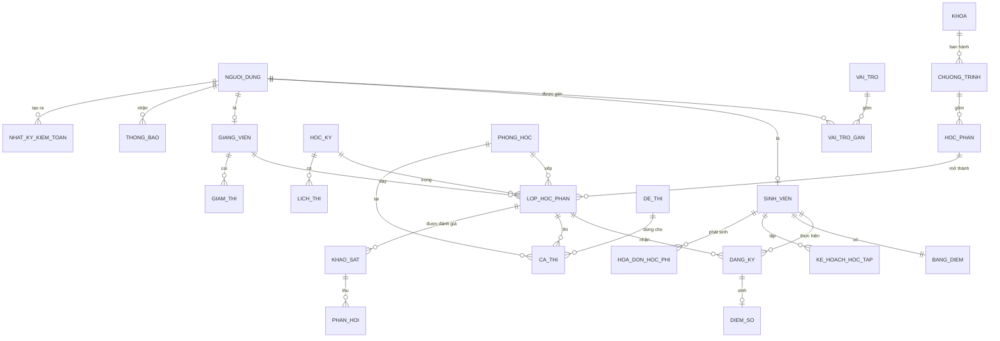
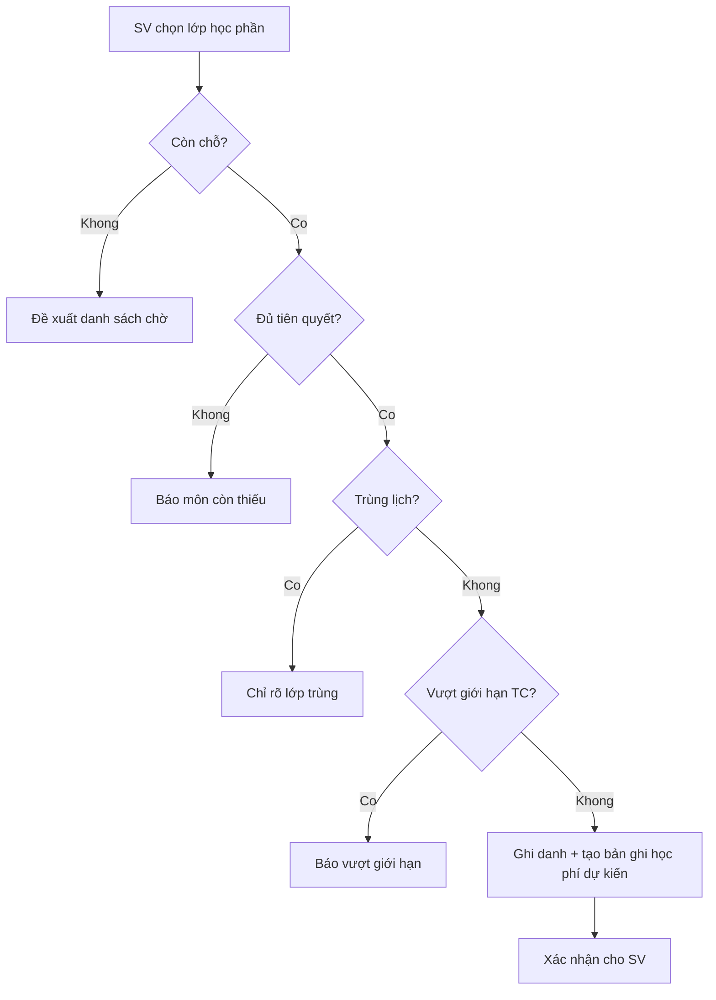
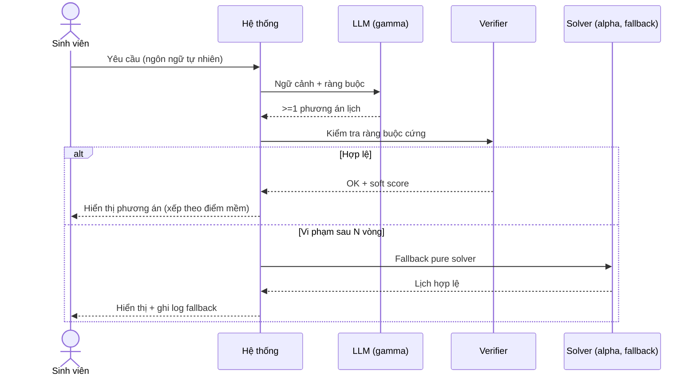
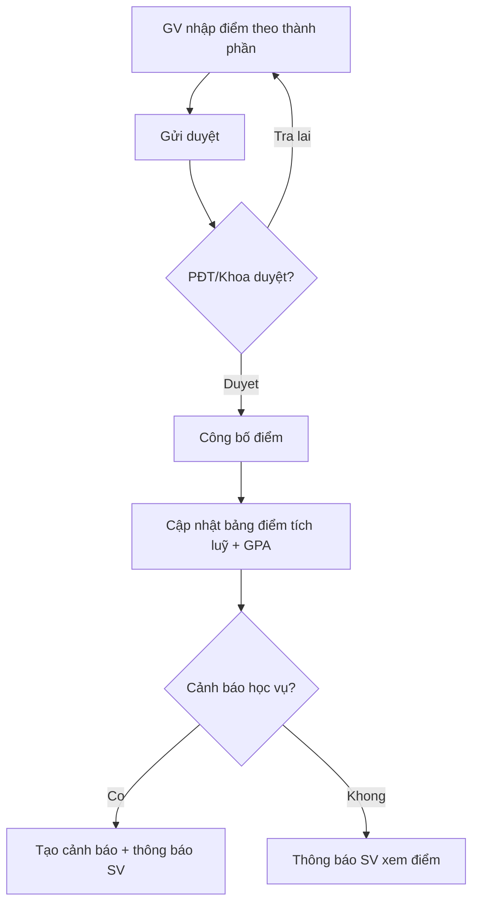
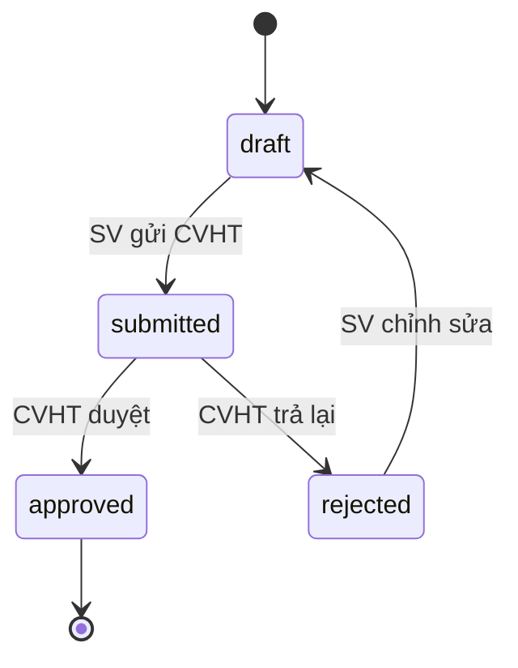
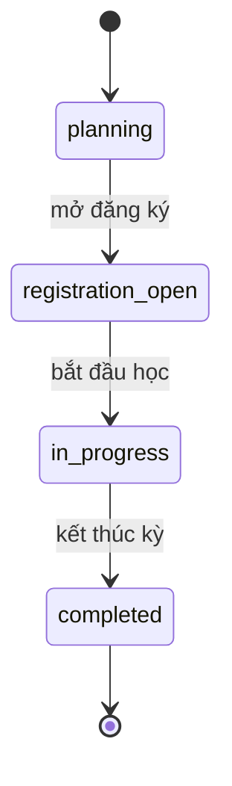
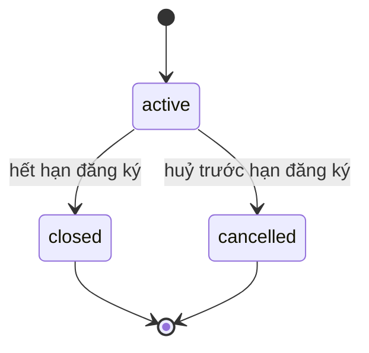
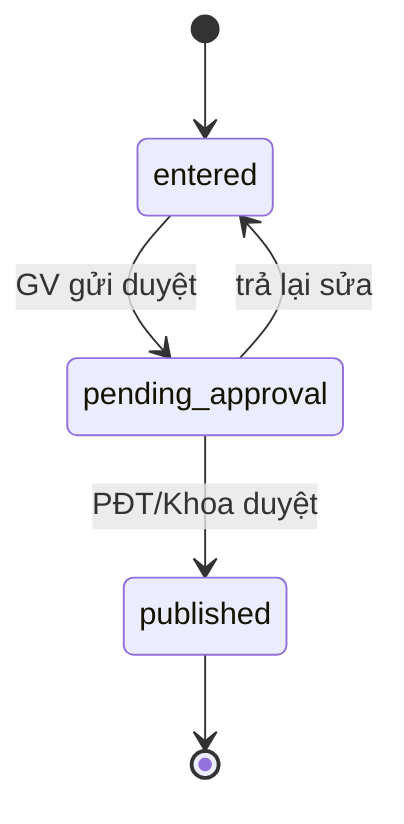
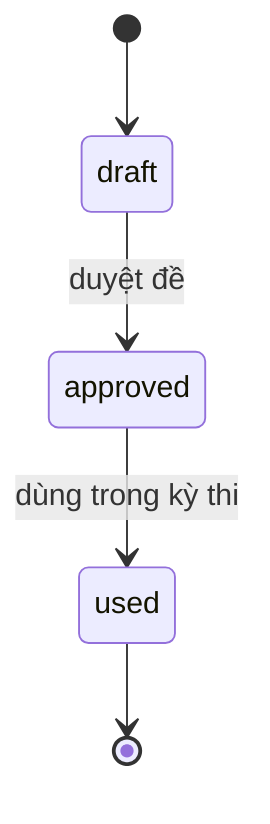
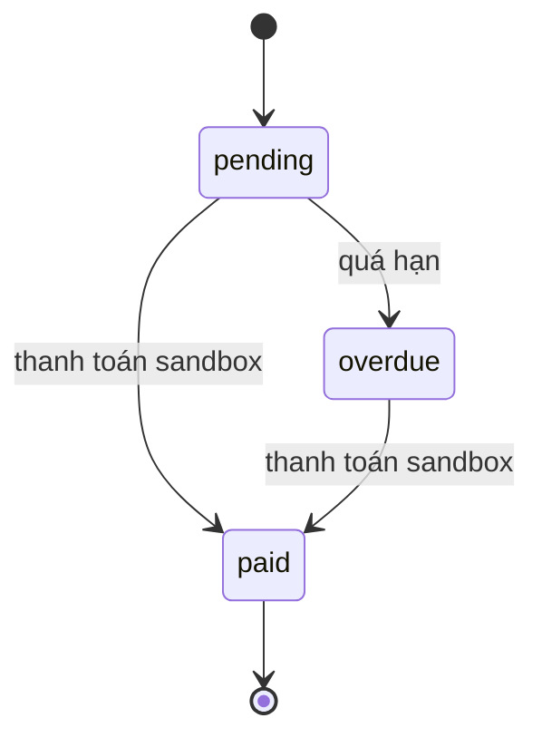

# 01 — Đặc tả Yêu cầu Phần mềm (Software Requirements Specification)

## 1. Thông tin tài liệu

### 1.1. Metadata

| Thuộc tính         | Giá trị                                                                                                                                                                                                                                                            |
| :----------------- | :----------------------------------------------------------------------------------------------------------------------------------------------------------------------------------------------------------------------------------------------------------------- |
| Tên tài liệu       | Đặc tả Yêu cầu Phần mềm (_Software Requirements Specification_)                                                                                                                                                                                                    |
| Mã tài liệu        | 01-srs                                                                                                                                                                                                                                                             |
| Dự án              | Nền tảng tích hợp hỗ trợ tổ chức đào tạo (NCKH_1)                                                                                                                                                                                                                  |
| Phiên bản          | v0.4.0                                                                                                                                                                                                                                                             |
| Trạng thái         | Draft                                                                                                                                                                                                                                                              |
| Người viết         | Hiếu                                                                                                                                                                                                                                                               |
| Người duyệt        | (chưa duyệt)                                                                                                                                                                                                                                                       |
| Ngày tạo           | 2026-06-02                                                                                                                                                                                                                                                         |
| Ngày cập nhật      | 2026-06-13                                                                                                                                                                                                                                                         |
| Tài liệu liên quan | [`../../CLAUDE.md`](../../CLAUDE.md), [`00-quy-chuan.md`](00-quy-chuan.md), [`../context/01-muc-tieu-nghien-cuu-ai.md`](../context/01-muc-tieu-nghien-cuu-ai.md), [`../context/02-ke-hoach-chuan-bi-nghien-cuu.md`](../context/02-ke-hoach-chuan-bi-nghien-cuu.md) |

### 1.2. Lịch sử thay đổi (Changelog)

| Phiên bản | Ngày       | Tác giả           | Thay đổi                                                                                                                                                                                                                                        |
| :-------- | :--------- | :---------------- | :---------------------------------------------------------------------------------------------------------------------------------------------------------------------------------------------------------------------------------------------- |
| 0.4.0     | 2026-06-13 | Khanh             | Gỡ §18 Glossary và §19 Ma trận truy ngược khỏi SRS (chuyển sang `context/GLOSSARY.md` & `context/DOMAIN-MAP.md`); đổi §20→§18 Tham chiếu; theo ADR-002.                                                                                         |
| 0.3.0     | 2026-06-13 | Khanh, AI Agent   | Tái cấu trúc theo mục lục mới; chuyển FR/NFR/AI/BR/giả định sang dạng bảng; thêm Tổng quan, Mục tiêu, Phạm vi, Mô hình dữ liệu mức cao, Use Case tổng quan, Phân quyền, Luồng nghiệp vụ, Trạng thái dữ liệu; sửa lỗi tham chiếu NFR-024→FR-024. |
| 0.2.0     | 2026-06-03 | team-architecture | Thêm FR-019–FR-024 (học kỳ, phòng, phân công GV, đề thi, xuất báo cáo, audit log); thêm NFR-012–NFR-015; bổ sung luồng ngoại lệ UC-003, UC-013; mở rộng glossary; cập nhật ma trận truy ngược.                                                  |
| 0.1.0     | 2026-06-02 | team-architecture | Bản nháp đầu tiên — đầy đủ UC, FR, NFR, AI, ràng buộc, glossary, traceability.                                                                                                                                                                  |

---

## 2. Mục lục

1. [Thông tin tài liệu](#1-thông-tin-tài-liệu)
2. [Mục lục](#2-mục-lục)
3. [Giới thiệu](#3-giới-thiệu)
4. [Tổng quan hệ thống](#4-tổng-quan-hệ-thống)
5. [Mục tiêu hệ thống](#5-mục-tiêu-hệ-thống)
6. [Phạm vi chức năng](#6-phạm-vi-chức-năng)
7. [Actor và vai trò](#7-actor-và-vai-trò)
8. [Giả định, ràng buộc, phụ thuộc](#8-giả-định-ràng-buộc-phụ-thuộc)
9. [Mô hình dữ liệu mức cao](#9-mô-hình-dữ-liệu-mức-cao)
10. [Functional Requirements](#10-functional-requirements)
11. [Non-Functional Requirements](#11-non-functional-requirements)
12. [Use Case tổng quan](#12-use-case-tổng-quan)
13. [Use Case chi tiết](#13-use-case-chi-tiết)
14. [Business Rules](#14-business-rules)
15. [Phân quyền chức năng](#15-phân-quyền-chức-năng)
16. [Luồng nghiệp vụ chính](#16-luồng-nghiệp-vụ-chính)
17. [Trạng thái dữ liệu quan trọng](#17-trạng-thái-dữ-liệu-quan-trọng)
18. [Tham chiếu](#18-tham-chiếu)

---

## 3. Giới thiệu

### 3.1. Mục đích

Tài liệu này đặc tả toàn bộ yêu cầu phần mềm của **Nền tảng tích hợp hỗ trợ tổ chức đào tạo đại học có ứng dụng AI** (mã nội bộ: _NCKH_1_). Tài liệu là đầu vào chính cho [`02-hld.md`](02-hld.md) (thiết kế tổng thể) và [`08-test-plan-acceptance-criteria.md`](08-test-plan-acceptance-criteria.md) (kiểm thử & nghiệm thu).

### 3.2. Đối tượng đọc

Người hướng dẫn, nhóm phát triển, người duyệt tài liệu, và các bên liên quan nghiệp vụ (xem [§7](#7-actor-và-vai-trò)).

### 3.3. Định nghĩa từ khoá nghĩa vụ

Tài liệu này tuân theo RFC 2119 / RFC 8174 ([`00-quy-chuan.md §6`](00-quy-chuan.md#6-mức-độ-nghĩa-vụ-rfc-2119--rfc-8174)). Các từ khoá **PHẢI**, **KHÔNG ĐƯỢC**, **NÊN**, **KHÔNG NÊN**, **CÓ THỂ** được dùng đúng nghĩa kỹ thuật và viết hoa trong toàn tài liệu.

### 3.4. Tài liệu tham chiếu

Xem [§18 Tham chiếu](#18-tham-chiếu).

---

## 4. Tổng quan hệ thống

### 4.1. Bối cảnh & vấn đề

Công tác tổ chức đào tạo tại một cơ sở giáo dục đại học là quy trình nhiều bên liên quan, ràng buộc lẫn nhau: khoa/bộ môn xây dựng chương trình và mở _học phần_ (_course_), phòng đào tạo tổ chức _lớp học phần_ (_course offering_) và quản lý học kỳ, giảng viên được phân công giảng dạy, sinh viên đăng ký học theo chương trình của mình. Xen suốt là các hoạt động tài chính (học phí) và trao đổi thông tin (thông báo, hỏi đáp học vụ).

Hiện trạng: các công cụ hỗ trợ rời rạc, thủ công và thiếu thông minh; khối lượng lớn công việc lặp lại và mang tính phân tích/giao tiếp chưa được tự động hoá.

### 4.2. Mô tả tổng quát

Nền tảng lấy **dữ liệu học vụ thống nhất** làm trung tâm (nguồn sự thật duy nhất), phục vụ đồng thời sáu nhóm người dùng nghiệp vụ và một vai trò kỹ thuật, ứng dụng AI xuyên suốt. AI cho năng lực **sinh thời khoá biểu cá nhân hoá** đi theo hướng nghiên cứu Pure LLM end-to-end (hướng γ — xem [`../context/01-muc-tieu-nghien-cuu-ai.md`](../context/01-muc-tieu-nghien-cuu-ai.md)); các năng lực AI còn lại theo lối "có AI thực dụng" (LLM + RAG + người duyệt).

### 4.3. Tám nhóm bài toán con

| #   | Nhóm bài toán                     | UC / năng lực AI liên quan              |
| :-- | :-------------------------------- | :-------------------------------------- |
| 1   | Hỗ trợ kế hoạch học tập sinh viên | UC-001, UC-002, UC-003 · AI-001, AI-002 |
| 2   | Tổ chức & giám sát đào tạo        | UC-004, UC-005 · AI-003                 |
| 3   | Tài chính học vụ (sandbox)        | UC-007, UC-008 · AI-008                 |
| 4   | AI xuyên suốt                     | AI-001 … AI-008                         |
| 5   | Quản lý kết quả học tập           | UC-009, UC-010 · AI-005                 |
| 6   | Tổ chức khảo thí                  | UC-011, UC-012 · AI-006                 |
| 7   | Phân tích & báo cáo cho lãnh đạo  | UC-016 · AI-003, AI-007                 |
| 8   | Đánh giá giảng dạy                | UC-013, UC-014 · AI-007                 |

---

## 5. Mục tiêu hệ thống

| Mã    | Mục tiêu                                                                                                | Cách đo / tiêu chí thành công                                                           |
| :---- | :------------------------------------------------------------------------------------------------------ | :-------------------------------------------------------------------------------------- |
| MT-01 | Vận hành đủ chức năng cho 6 nhóm người dùng nghiệp vụ + SysAdmin trên 8 nhóm bài toán con.              | Mọi UC trong [§12](#12-use-case-tổng-quan) đạt acceptance criteria ở `08-test-plan`.    |
| MT-02 | Giữ một nguồn sự thật duy nhất cho dữ liệu học vụ.                                                      | Không có thành phần nào ghi trùng lặp dữ liệu học vụ (kiểm tra ở `02-hld`/`04-db`).     |
| MT-03 | Mỗi năng lực AI có ≥ 1 chỉ số định lượng chứng minh hiệu quả.                                           | 8/8 năng lực AI trong [§10.11](#1011-yêu-cầu-năng-lực-ai-ai-xxx) có ngưỡng đậu đo được. |
| MT-04 | Trả lời câu hỏi nghiên cứu RQ-AI (Pure LLM sinh lịch so với baseline solver).                           | So sánh γ/α/β trên VACS theo M1–M6 ([`AI-002`](#ai-002)); kiểm định H1–H3.              |
| MT-05 | Bảo đảm an toàn & tuân thủ ràng buộc cứng (sandbox, người duyệt AI, ẩn danh khảo sát, trích dẫn nguồn). | Mọi Business Rule [§14](#14-business-rules) được kiểm thử và không vi phạm.             |

---

## 6. Phạm vi chức năng

### 6.1. Trong phạm vi (in-scope)

| Mảng                       | Mô tả ngắn                                                                                              |
| :------------------------- | :------------------------------------------------------------------------------------------------------ |
| Kế hoạch & đăng ký học tập | Gợi ý môn, sinh thời khoá biểu AI, duyệt kế hoạch (CVHT), đăng ký học phần.                             |
| Tổ chức đào tạo            | Quản lý chương trình, học phần, lớp học phần, học kỳ, phòng, phân công giảng viên; cảnh báo bất thường. |
| Tài chính học vụ (sandbox) | Tính/ước tính học phí theo tín chỉ; thanh toán mô phỏng; theo dõi công nợ.                              |
| Kết quả học tập            | Nhập–duyệt–công bố điểm; bảng điểm tích luỹ; cảnh báo học vụ; dự báo nguy cơ.                           |
| Khảo thí                   | Lập lịch thi, phân phòng & giám thị, quản lý thông tin đề thi.                                          |
| Đánh giá giảng dạy         | Khảo sát ẩn danh cuối kỳ; tổng hợp + phân tích cảm xúc/chủ đề.                                          |
| Báo cáo lãnh đạo           | Dashboard chỉ số đào tạo (read-only); xuất báo cáo.                                                     |
| AI xuyên suốt              | Gợi ý, sinh lịch, cảnh báo, hỏi đáp có trích dẫn, soạn email/thông báo (có người duyệt).                |

### 6.2. Ngoài phạm vi (out-of-scope)

| Mã     | Hạng mục ngoài phạm vi                                                       | Căn cứ                         |
| :----- | :--------------------------------------------------------------------------- | :----------------------------- |
| OOS-01 | Tích hợp cổng thanh toán thật, lưu dữ liệu tài chính thật.                   | [`BR-001`](#14-business-rules) |
| OOS-02 | Miễn/giảm học phí theo chính sách.                                           | [`BR-005`](#14-business-rules) |
| OOS-03 | Đa thuê bao (_multi-tenant_) nhiều trường, phân cấp trường.                  | [`BR-006`](#14-business-rules) |
| OOS-04 | Giao diện nhập/sửa dữ liệu cho vai trò Lãnh đạo.                             | [`BR-007`](#14-business-rules) |
| OOS-05 | Lưu nội dung đề thi dạng văn bản thuần trong CSDL (chỉ lưu tham chiếu file). | [`FR-022`](#fr-022)            |

---

## 7. Actor và vai trò

| Nhóm                   | Mã vai trò (`role`)     | Vai trò chính                                                                                                 | Mức quan tâm |
| :--------------------- | :---------------------- | :------------------------------------------------------------------------------------------------------------ | :----------- |
| Sinh viên              | `student`               | Lập kế hoạch học tập, đăng ký học phần, xem học phí, hỏi đáp học vụ, khảo sát đánh giá giảng dạy.             | Cao          |
| Giảng viên             | `lecturer`              | Xem lớp được phân công, lịch dạy, danh sách sinh viên, xem feedback; nhập điểm.                               | Cao          |
| Cố vấn học tập (CVHT)  | `academic_advisor` (\*) | Duyệt kế hoạch học tập và theo dõi tiến độ sinh viên được phân công. (\*) capability bổ sung trên `lecturer`. | Cao          |
| Khoa / Bộ môn          | `department`            | Quản lý chương trình, học phần, phân công giảng dạy, theo dõi chất lượng giảng dạy.                           | Cao          |
| Phòng Đào tạo          | `training_office`       | Tổ chức lớp học phần, quản lý học kỳ/phòng, theo dõi học phí, giám sát bất thường, tổng hợp đánh giá.         | Cao          |
| Phòng Khảo thí         | `examination_office`    | Lập lịch thi, phân phòng, phân giám thị, quản lý đề thi.                                                      | Cao          |
| Lãnh đạo cấp trường    | `leadership`            | Đọc dashboard tổng hợp & báo cáo (read-only). Không cấu hình, không nhập/sửa dữ liệu nghiệp vụ.               | Trung bình   |
| Quản trị viên hệ thống | `sysadmin`              | Vai trò kỹ thuật: quản tài khoản, phân vai trò, backup, log. Không tác động lên dữ liệu nghiệp vụ.            | Trung bình   |

---

## 8. Giả định, ràng buộc, phụ thuộc

### 8.1. Giả định

| Mã        | Giả định                                                                                                                          |
| :-------- | :-------------------------------------------------------------------------------------------------------------------------------- |
| `ASS-001` | Trường/khoa có thể cung cấp quy chế đào tạo, chương trình đào tạo dạng văn bản đọc được để nạp vào corpus RAG.                    |
| `ASS-002` | API LLM từ ≥ 2 nhà cung cấp (Anthropic, OpenAI, hoặc tương đương) sẵn có và ổn định trong vòng 6 tháng từ khi bắt đầu thí nghiệm. |
| `ASS-003` | Có thể tiếp cận ≥ 30 sinh viên cho human study ([`AI-002`](#ai-002) — M3) theo quy trình được cố vấn/nhà trường cho phép.         |
| `ASS-004` | Hạ tầng triển khai là cloud hoặc server vật lý do nhóm phát triển quản lý; không phụ thuộc hệ thống CNTT hiện tại của trường.     |

### 8.2. Ràng buộc

> Ràng buộc nghiệp vụ cứng (enforceable) được đặc tả tách riêng tại [§14 Business Rules](#14-business-rules). Mục này nêu ràng buộc phạm vi & kỹ thuật cấp dự án.

| Mã        | Ràng buộc                                                                                | Liên quan                                                                                              |
| :-------- | :--------------------------------------------------------------------------------------- | :----------------------------------------------------------------------------------------------------- |
| `CON-001` | Tài chính học vụ chỉ chạy ở môi trường sandbox; không tiền thật.                         | [`BR-001`](#14-business-rules)                                                                         |
| `CON-002` | Phạm vi triển khai trong một khoa/trường; không multi-tenant.                            | [`BR-006`](#14-business-rules)                                                                         |
| `CON-003` | LLM backbone dùng API model có sẵn (không pre-train, không fine-tune ở giai đoạn chính). | [`../context/01-muc-tieu-nghien-cuu-ai.md §6`](../context/01-muc-tieu-nghien-cuu-ai.md#6-llm-backbone) |
| `CON-004` | Verifier trong luồng AI sinh lịch là hàm thuần kiểm tra, không phải solver.              | [`BR-008`](#14-business-rules)                                                                         |
| `CON-005` | Tài liệu, mã nguồn, commit message bằng tiếng Anh; tài liệu nghiệp vụ bằng tiếng Việt.   | [`../../CLAUDE.md §3.1`](../../CLAUDE.md)                                                              |

### 8.3. Phụ thuộc

| Mã        | Phụ thuộc bên ngoài                              | Cần cho                                  |
| :-------- | :----------------------------------------------- | :--------------------------------------- |
| `DEP-001` | API LLM ≥ 2 provider + budget tracking.          | AI-001 … AI-008                          |
| `DEP-002` | Corpus quy chế, chương trình đào tạo (RAG).      | [`AI-004`](#ai-004), [`UC-015`](#uc-015) |
| `DEP-003` | Dữ liệu lớp học phần, phòng, giảng viên thực tế. | [`UC-002`](#uc-002), [`UC-011`](#uc-011) |
| `DEP-004` | ≥ 30 sinh viên cho human study.                  | [`AI-002`](#ai-002) — M3                 |
| `DEP-005` | Hạ tầng triển khai (cloud/server).               | Toàn hệ thống                            |

---

## 9. Mô hình dữ liệu mức cao

> Mô hình **mức khái niệm** — chỉ thực thể chính và quan hệ. Thuộc tính, kiểu dữ liệu, ràng buộc chi tiết thuộc [`04-database-design.md`](04-database-design.md).

_Sơ đồ trên mô tả các thực thể cốt lõi của miền học vụ và quan hệ chính. `KHAO_SAT`/`PHAN_HOI` tách rời `NGUOI_DUNG` để bảo đảm ẩn danh ([`BR-004`](#14-business-rules)); `NHAT_KY_KIEM_TOAN` ghi vết mọi thay đổi nghiệp vụ ([`FR-024`](#fr-024))._

---

## 10. Functional Requirements

> Mỗi FR phát biểu theo "Hệ thống **PHẢI/NÊN** …" và ánh xạ tới ≥ 1 UC. Cột **Mức** dùng từ khoá RFC 2119.

### 10.1. Xác thực & phân quyền

| Mã                        | Yêu cầu                                                                                                                                                                                                            | Mức               | UC     |
| :------------------------ | :----------------------------------------------------------------------------------------------------------------------------------------------------------------------------------------------------------------- | :---------------- | :----- |
| FR-001 | Cho phép đăng nhập bằng email + mật khẩu; hỗ trợ thêm SSO theo cổng xác thực của trường nếu tồn tại.                                                                                                               | PHẢI (SSO: NÊN)   | Tất cả |
| FR-002 | Gán vai trò cho từng tài khoản (`student`, `lecturer`, `academic_advisor`, `department`, `training_office`, `examination_office`, `leadership`, `sysadmin`) và kiểm tra quyền trước mỗi thao tác thay đổi dữ liệu. | PHẢI              | Tất cả |
| FR-003 | Cho phép SysAdmin tạo/vô hiệu hoá/đổi vai trò tài khoản; KHÔNG ĐƯỢC cho SysAdmin đọc/sửa dữ liệu nghiệp vụ (điểm, học phí, khảo sát).                                                                              | PHẢI / KHÔNG ĐƯỢC | —      |

### 10.2. Chương trình & học phần

| Mã                        | Yêu cầu                                                                                                                        | Mức  | UC                                                      |
| :------------------------ | :----------------------------------------------------------------------------------------------------------------------------- | :--- | :------------------------------------------------------ |
| FR-004 | Lưu trữ chương trình đào tạo (danh sách học phần, số tín chỉ, tiên quyết, tương đương, phân loại); cho Khoa/Bộ môn tạo và sửa. | PHẢI | [UC-001](#uc-001), [UC-002](#uc-002), [UC-006](#uc-006) |
| FR-005 | Cho Khoa tạo/sửa/vô hiệu hoá học phần (mã, tên, số tín chỉ, mô tả, tiên quyết, số tiết LT/TH).                                 | PHẢI | —                                                       |

### 10.3. Lớp học phần, học kỳ, phòng & phân công

| Mã                        | Yêu cầu                                                                                                                                                                                                                    | Mức                  | UC                                                      |
| :------------------------ | :------------------------------------------------------------------------------------------------------------------------------------------------------------------------------------------------------------------------- | :------------------- | :------------------------------------------------------ |
| FR-006 | Cho Phòng Đào tạo tạo lớp học phần (học phần, giảng viên, học kỳ, sĩ số, phòng, thời khoá biểu); tự động từ chối nếu giảng viên hoặc phòng bị xung đột lịch.                                                               | PHẢI                 | [UC-004](#uc-004)                                       |
| FR-019 | Cho Phòng Đào tạo tạo & quản lý học kỳ (mã, tên, ngày bắt đầu/kết thúc, mở/đóng đăng ký, trạng thái `planning`/`registration_open`/`in_progress`/`completed`); chỉ cho tạo lớp khi học kỳ ở `planning` hoặc `in_progress`. | PHẢI                 | [UC-004](#uc-004), [UC-006](#uc-006)                    |
| FR-020 | Lưu danh sách phòng học/phòng thi (mã, toà nhà, sức chứa, loại `lecture`/`lab`/`exam`); từ chối xếp lịch nếu phòng đã dùng cùng tiết–thứ.                                                                                  | PHẢI                 | [UC-004](#uc-004), [UC-011](#uc-011), [UC-012](#uc-012) |
| FR-021 | Cho Khoa/Phòng Đào tạo phân công giảng viên cho lớp; từ chối nếu giảng viên trùng lịch; cảnh báo khi tổng tiết/tuần vượt ngưỡng (mặc định 20 tiết/tuần).                                                                   | PHẢI (cảnh báo: NÊN) | [UC-004](#uc-004), [UC-005](#uc-005)                    |

### 10.4. Đăng ký học phần & danh sách chờ

| Mã                        | Yêu cầu                                                                                                                                                                            | Mức  | UC                |
| :------------------------ | :--------------------------------------------------------------------------------------------------------------------------------------------------------------------------------- | :--- | :---------------- |
| FR-007 | Cho sinh viên đăng ký lớp học phần trong thời gian đăng ký; từ chối nếu hết chỗ, thiếu tiên quyết, trùng lịch, vượt giới hạn tín chỉ/kỳ; xử lý _idempotent_ với `Idempotency-Key`. | PHẢI | [UC-006](#uc-006) |
| FR-008 | Cho sinh viên vào danh sách chờ khi lớp hết chỗ; thông báo cho sinh viên đầu danh sách khi có chỗ trống.                                                                           | NÊN  | [UC-006](#uc-006) |

### 10.5. Tài chính học vụ (sandbox)

| Mã                        | Yêu cầu                                                                                                                                                      | Mức               | UC                                   |
| :------------------------ | :----------------------------------------------------------------------------------------------------------------------------------------------------------- | :---------------- | :----------------------------------- |
| FR-009 | Tính học phí theo số tín chỉ đăng ký × đơn giá (cấu hình theo học kỳ/chương trình); mọi giao dịch chạy sandbox; KHÔNG ĐƯỢC lưu/xử lý dữ liệu tài chính thật. | PHẢI / KHÔNG ĐƯỢC | [UC-007](#uc-007), [UC-008](#uc-008) |
| FR-010 | Cung cấp giao diện thanh toán học phí mô phỏng; KHÔNG ĐƯỢC tích hợp cổng thật; thao tác thanh toán idempotent với `Idempotency-Key`.                         | PHẢI / KHÔNG ĐƯỢC | [UC-007](#uc-007)                    |

### 10.6. Kết quả học tập

| Mã                        | Yêu cầu                                                                                                                                 | Mức  | UC                |
| :------------------------ | :-------------------------------------------------------------------------------------------------------------------------------------- | :--- | :---------------- |
| FR-011 | Cho giảng viên nhập điểm cho từng sinh viên trong lớp được phân công; hỗ trợ nhiều thành phần điểm theo trọng số cấu hình của học phần. | PHẢI | [UC-009](#uc-009) |
| FR-012 | Yêu cầu bước duyệt (Phòng Đào tạo hoặc Khoa) trước khi công bố điểm; cập nhật bảng điểm tích luỹ ngay sau công bố.                      | PHẢI | [UC-009](#uc-009) |
| FR-013 | Tính & lưu GPA tích luỹ, số tín chỉ đạt, tình trạng học vụ theo quy chế.                                                                | PHẢI | [UC-010](#uc-010) |

### 10.7. Khảo thí & đề thi

| Mã                        | Yêu cầu                                                                                                                                                                           | Mức               | UC                |
| :------------------------ | :-------------------------------------------------------------------------------------------------------------------------------------------------------------------------------- | :---------------- | :---------------- |
| FR-014 | Cho Phòng Khảo thí tạo/sửa lịch thi; kiểm tra và cảnh báo nếu có sinh viên trùng lịch thi.                                                                                        | PHẢI              | [UC-011](#uc-011) |
| FR-015 | Hỗ trợ phân phòng & giám thị tự động; bảo đảm sức chứa phòng ≥ số sinh viên; không phân giảng viên dạy lớp làm giám thị chính cho lớp đó.                                         | PHẢI              | [UC-012](#uc-012) |
| FR-022 | Cho Phòng Khảo thí lưu thông tin đề thi (mã đề, học phần, học kỳ, trạng thái `draft`/`approved`/`used`); KHÔNG ĐƯỢC lưu nội dung đề dạng văn bản thuần — chỉ lưu tham chiếu file. | PHẢI / KHÔNG ĐƯỢC | [UC-011](#uc-011) |

### 10.8. Đánh giá giảng dạy

| Mã                        | Yêu cầu                                                                                                                                                    | Mức               | UC                                   |
| :------------------------ | :--------------------------------------------------------------------------------------------------------------------------------------------------------- | :---------------- | :----------------------------------- |
| FR-016 | Tổ chức khảo sát ẩn danh cuối kỳ; KHÔNG ĐƯỢC lưu liên kết danh tính với câu trả lời; chỉ công bố khi số phản hồi ≥ ngưỡng (mặc định 5/lớp, cấu hình được). | PHẢI / KHÔNG ĐƯỢC | [UC-013](#uc-013), [UC-014](#uc-014) |

### 10.9. Thông báo

| Mã                        | Yêu cầu                                                                                                                                                | Mức               | UC                                   |
| :------------------------ | :----------------------------------------------------------------------------------------------------------------------------------------------------- | :---------------- | :----------------------------------- |
| FR-017 | Gửi thông báo trong ứng dụng (_in-app_) cho: điểm công bố, đăng ký thành công/thất bại, kế hoạch được duyệt/trả về, lịch thi công bố, cảnh báo học vụ. | PHẢI              | [UC-003](#uc-003), [UC-009](#uc-009) |
| FR-018 | Hỗ trợ AI soạn email/thông báo hàng loạt; mọi nội dung AI gửi người dùng cuối PHẢI qua bước duyệt; KHÔNG ĐƯỢC gửi tự động khi chưa duyệt.              | PHẢI / KHÔNG ĐƯỢC | [UC-008](#uc-008)                    |

### 10.10. Xuất báo cáo & nhật ký kiểm toán

| Mã                        | Yêu cầu                                                                                                                                                                                                                                                     | Mức                   | UC                                                      |
| :------------------------ | :---------------------------------------------------------------------------------------------------------------------------------------------------------------------------------------------------------------------------------------------------------- | :-------------------- | :------------------------------------------------------ |
| FR-023 | Cho Lãnh đạo/Phòng Đào tạo/Khoa xuất báo cáo tổng hợp dạng PDF; hỗ trợ thêm xuất CSV/Excel cho dữ liệu bảng.                                                                                                                                                | PHẢI (CSV/Excel: NÊN) | [UC-008](#uc-008), [UC-014](#uc-014), [UC-016](#uc-016) |
| FR-024 | Tự động ghi nhật ký kiểm toán (xem [`NFR-009`](#nfr-009)) cho mọi thay đổi dữ liệu nghiệp vụ, mọi lần duyệt/từ chối AI output, mọi lần đăng nhập/đăng xuất/đổi mật khẩu. Mỗi bản ghi PHẢI có: timestamp UTC, user ID, vai trò, hành động, ID đối tượng, IP. | PHẢI                  | [UC-004](#uc-004), [UC-009](#uc-009)                    |

### 10.11. Yêu cầu năng lực AI (AI-XXX)

> Mỗi năng lực AI **PHẢI** có ≥ 1 chỉ số đánh giá định lượng kèm phương pháp đo, bộ dữ liệu và ngưỡng đậu. Định nghĩa chi tiết M1–M6: [`../context/01-muc-tieu-nghien-cuu-ai.md §5.3`](../context/01-muc-tieu-nghien-cuu-ai.md#53-chỉ-số-đo).

#### 10.11.1. Bảng tổng hợp năng lực AI

| Mã                        | Năng lực                             | Mức               | Chỉ số đánh giá                                                          | Ngưỡng đậu                          | Phương pháp đo                                          | UC                |
| :------------------------ | :----------------------------------- | :---------------- | :----------------------------------------------------------------------- | :---------------------------------- | :------------------------------------------------------ | :---------------- |
| AI-001 | Gợi ý môn học theo chương trình      | PHẢI              | CCR (gợi ý) — tỉ lệ ràng buộc tiên quyết/tiến độ hiểu đúng               | ≥ 0.85                              | VACS bộ con `easy`, 100 examples, so với gold label     | [UC-001](#uc-001) |
| AI-003 | Cảnh báo bất thường đào tạo          | PHẢI              | Precision cảnh báo                                                       | ≥ 0.80                              | 50 tình huống có nhãn (30 dương, 20 âm)                 | [UC-005](#uc-005) |
| AI-004 | Hỏi đáp học vụ có trích dẫn nguồn    | PHẢI / KHÔNG ĐƯỢC | Citation Accuracy — tỉ lệ trả lời có ≥ 1 trích dẫn đúng, kiểm chứng được | ≥ 0.90                              | 100 câu hỏi có đáp án gold; đánh giá thủ công trích dẫn | [UC-015](#uc-015) |
| AI-005 | Dự báo nguy cơ học vụ                | NÊN               | Recall (kèm Precision ≥ 0.60)                                            | Recall ≥ 0.70 (F1 ≥ 0.64)           | Backtest ≥ 2 học kỳ dữ liệu (ẩn danh) hoặc giả lập      | [UC-010](#uc-010) |
| AI-006 | Sinh lịch thi tối ưu                 | PHẢI              | Conflict Rate — tỉ lệ SV trùng ≥ 2 lịch thi/ngày                         | ≤ 5% (baseline ngẫu nhiên ≥ 20–30%) | 10 bộ dữ liệu giả lập; so AI vs phân ngẫu nhiên         | [UC-011](#uc-011) |
| AI-007 | Phân tích cảm xúc & tóm tắt feedback | PHẢI              | Sentiment Accuracy (3 nhãn: tích cực/trung lập/tiêu cực)                 | ≥ 0.80                              | 200 nhận xét gán nhãn (thật hoặc giả lập); đo accuracy  | [UC-014](#uc-014) |
| AI-008 | Soạn email/thông báo hàng loạt       | PHẢI              | Tỉ lệ nháp được duyệt chấp nhận không cần sửa đáng kể (≤ 20% chỉnh sửa)  | ≥ 0.70 / 50 nháp kiểm thử           | Phản hồi người duyệt trong thử nghiệm nội bộ            | [UC-008](#uc-008) |

**Fallback bắt buộc:** AI-001 **PHẢI** fallback sang gợi ý dựa quy tắc (lọc tiên quyết) khi AI lỗi. [`AI-002`](#ai-002) **PHẢI** fallback sang pure solver (α) khi LLM không trả lời trong ngưỡng thời gian. Mọi output của AI-008 **PHẢI** qua người duyệt ([`FR-018`](#fr-018), [`BR-002`](#14-business-rules)).

#### 10.11.2. AI-002 — Sinh thời khoá biểu cá nhân hoá (hướng nghiên cứu chính)

Hệ thống **PHẢI** sinh thời khoá biểu không trùng lịch từ yêu cầu ngôn ngữ tự nhiên, dùng kiến trúc Pure LLM kèm verifier (hướng γ — [`../context/01-muc-tieu-nghien-cuu-ai.md §4`](../context/01-muc-tieu-nghien-cuu-ai.md#4-quyết-định-chốt-hướng-nghiên-cứu-c--pure-llm-end-to-end)).

| Chỉ số | Tên                                                                           | Ngưỡng đậu                                    |
| :----- | :---------------------------------------------------------------------------- | :-------------------------------------------- |
| M1     | SVR — _Schedule Validity Rate_ (không vi phạm ràng buộc cứng, verifier check) | ≥ 0.90 × SVR(α) trên VACS full (300 examples) |
| M2     | CCR — _Constraint Capture Rate_ (ràng buộc người dùng hiểu đúng)              | ≥ 0.85                                        |
| M3     | UPS — _User Preference Score_ (chủ quan 1–5, human study ≥ 30 SV)             | trung bình ≥ 3.8                              |
| M4     | Latency p95                                                                   | ≤ 8s (xem [`NFR-003`](#nfr-003))              |
| M5     | Token                                                                         | ≤ 8000 token (in + out) / lượt                |
| M6     | Soft-criteria adherence (rubric VACS)                                         | ≥ 0.75                                        |

_Phương pháp đo M1/M2:_ chạy cấu hình γ₀–γ₄ trên VACS; mỗi cấu hình ≥ 3 lần độc lập (bootstrap CI). _Fallback:_ pure solver (α) khi LLM quá hạn thời gian. _UC liên quan:_ [UC-002](#uc-002).

---

## 11. Non-Functional Requirements

> Cột **Ngưỡng/Chỉ tiêu** là điều kiện kiểm chứng. Cột **Mức** dùng từ khoá RFC 2119.

### 11.1. Hiệu năng

| Mã                          | Yêu cầu                                                               | Ngưỡng/Chỉ tiêu                            | Mức  |
| :-------------------------- | :-------------------------------------------------------------------- | :----------------------------------------- | :--- |
| NFR-001 | Thời gian phản hồi API nghiệp vụ (đăng ký, xem điểm, xem TKB đã lưu). | p95 ≤ 300ms khi ≤ 200 người dùng đồng thời | PHẢI |
| NFR-002 | Thời gian gợi ý môn học ([`UC-001`](#uc-001)).                        | p95 ≤ 3s khi ≤ 100 yêu cầu đồng thời       | PHẢI |
| NFR-003 | Thời gian sinh thời khoá biểu AI ([`UC-002`](#uc-002)).               | p95 ≤ 8s khi ≤ 50 yêu cầu đồng thời        | PHẢI |
| NFR-004 | Tải đồng thời tối đa đợt cao điểm đăng ký.                            | ≤ 500 người dùng đồng thời, không lỗi 5xx  | PHẢI |

### 11.2. Khả dụng

| Mã                          | Yêu cầu                           | Ngưỡng/Chỉ tiêu                         | Mức  |
| :-------------------------- | :-------------------------------- | :-------------------------------------- | :--- |
| NFR-005 | Uptime hằng tháng.                | ≥ 99% / tháng dương lịch (~7h downtime) | PHẢI |
| NFR-006 | Khôi phục sau sự cố nghiêm trọng. | RTO ≤ 2 giờ; RPO ≤ 1 giờ                | PHẢI |

### 11.3. Bảo mật

| Mã                          | Yêu cầu                                                             | Ngưỡng/Chỉ tiêu                                                                     | Mức               |
| :-------------------------- | :------------------------------------------------------------------ | :---------------------------------------------------------------------------------- | :---------------- |
| NFR-007 | Phân quyền mặc định từ chối; chỉ cấp quyền khi khai báo tường minh. | Mọi tài nguyên có khai báo quyền                                                    | PHẢI              |
| NFR-008 | Mã hoá dữ liệu nhạy cảm.                                            | Mật khẩu bcrypt/argon2; PII at-rest; TLS ≥ 1.2 in-transit                           | PHẢI              |
| NFR-009 | Nhật ký kiểm toán không sửa được.                                   | Đăng nhập/đăng xuất, thay đổi dữ liệu học vụ, duyệt AI; chỉ SysAdmin xem, không sửa | PHẢI / KHÔNG ĐƯỢC |

### 11.4. Khả năng bảo trì

| Mã                          | Yêu cầu                                                                                    | Ngưỡng/Chỉ tiêu                                                                   | Mức                 |
| :-------------------------- | :----------------------------------------------------------------------------------------- | :-------------------------------------------------------------------------------- | :------------------ |
| NFR-010 | Tách lớp trình bày/ứng dụng/miền/hạ tầng; phụ thuộc một chiều từ ngoài vào trong.          | Kiểm tra ở `02-hld`/`03-lld`                                                      | PHẢI                |
| NFR-011 | Quan trắc: structured log (JSON) cho mọi API & lời gọi AI; ≥ 1 metric/use case quan trọng. | 100% API có log JSON                                                              | PHẢI                |
| NFR-012 | Lưu trữ nhật ký.                                                                           | Audit log ≥ 2 năm; app log ≥ 90 ngày; sao lưu cùng chu kỳ dữ liệu nghiệp vụ       | PHẢI (app log: NÊN) |
| NFR-013 | Độ phủ kiểm thử.                                                                           | Logic nghiệp vụ ≥ 80% dòng; verifier ([`BR-008`](#14-business-rules)) ≥ 90% nhánh | PHẢI                |

### 11.5. Khả năng mở rộng

| Mã                          | Yêu cầu                                                    | Ngưỡng/Chỉ tiêu                                                                                  | Mức                  |
| :-------------------------- | :--------------------------------------------------------- | :----------------------------------------------------------------------------------------------- | :------------------- |
| NFR-014 | Mở rộng theo chiều ngang bằng thêm instance, không đổi mã. | Không lưu session state trong bộ nhớ instance; state ở CSDL/cache dùng chung                     | PHẢI                 |
| NFR-015 | Giới hạn tốc độ (_rate limit_) bảo vệ ngân sách token.     | Endpoint AI ≤ 30 req/phút/tài khoản; nghiệp vụ thường ≤ 300 req/phút/tài khoản; cấu hình qua env | PHẢI (cấu hình: NÊN) |

---

## 12. Use Case tổng quan

| Mã                | Tên                                 | Actor chính                | Nhóm bài toán | FR liên quan                           |
| :---------------- | :---------------------------------- | :------------------------- | :------------ | :------------------------------------- |
| [UC-001](#uc-001) | Gợi ý môn học theo chương trình     | Sinh viên                  | 1             | FR-004, FR-007                         |
| [UC-002](#uc-002) | Sinh thời khoá biểu cá nhân hoá     | Sinh viên                  | 1             | FR-006, FR-007, FR-019, FR-020         |
| [UC-003](#uc-003) | Duyệt kế hoạch học tập (CVHT)       | CVHT                       | 1             | FR-002, FR-017                         |
| [UC-004](#uc-004) | Quản lý lớp học phần                | Phòng Đào tạo              | 2             | FR-006, FR-019, FR-020, FR-021, FR-024 |
| [UC-005](#uc-005) | Cảnh báo bất thường đào tạo         | Hệ thống / Phòng Đào tạo   | 2             | FR-017, FR-021                         |
| [UC-006](#uc-006) | Đăng ký học phần                    | Sinh viên                  | 1             | FR-004, FR-007, FR-008, FR-019         |
| [UC-007](#uc-007) | Xem và ước tính học phí             | Sinh viên                  | 3             | FR-009, FR-010                         |
| [UC-008](#uc-008) | Theo dõi học phí & cảnh báo công nợ | Phòng Đào tạo              | 3             | FR-009, FR-018, FR-023                 |
| [UC-009](#uc-009) | Nhập và công bố điểm                | Giảng viên                 | 5             | FR-011, FR-012, FR-017, FR-024         |
| [UC-010](#uc-010) | Xem bảng điểm tích luỹ              | Sinh viên                  | 5             | FR-013                                 |
| [UC-011](#uc-011) | Lập lịch thi                        | Phòng Khảo thí             | 6             | FR-014, FR-015, FR-019, FR-020, FR-022 |
| [UC-012](#uc-012) | Phân phòng và giám thị              | Phòng Khảo thí             | 6             | FR-015, FR-020                         |
| [UC-013](#uc-013) | Khảo sát đánh giá giảng dạy         | Sinh viên                  | 8             | FR-016                                 |
| [UC-014](#uc-014) | Xem tổng hợp đánh giá giảng dạy     | GV / Khoa / PĐT / Lãnh đạo | 8             | FR-016, FR-023                         |
| [UC-015](#uc-015) | Hỏi đáp học vụ có trích dẫn nguồn   | Sinh viên                  | 4             | — (năng lực [AI-004](#ai-004))         |
| [UC-016](#uc-016) | Xem dashboard tổng hợp              | Lãnh đạo                   | 7             | FR-002, FR-013, FR-023                 |

---

## 13. Use Case chi tiết

> Quy ước: mỗi UC có ID `UC-XXX`, actor chính, tiền điều kiện, luồng chính, luồng ngoại lệ và hậu điều kiện. Luồng ngoại lệ chỉ liệt kê trường hợp khác biệt đáng kể so với luồng chính.

### 13.1. Nhóm UC: Kế hoạch học tập sinh viên

#### UC-001 — Gợi ý môn học theo chương trình

| Thuộc tính     | Giá trị                                                                              |
| :------------- | :----------------------------------------------------------------------------------- |
| Actor chính    | Sinh viên                                                                            |
| Actor phụ      | Hệ thống AI (γ/α), Cố vấn học tập (CVHT)                                             |
| Tiền điều kiện | Sinh viên đã đăng nhập; dữ liệu chương trình đào tạo và kết quả học tập sẵn có.      |
| Hậu điều kiện  | Sinh viên nhận danh sách môn học được gợi ý kèm lý do; có thể lưu vào kế hoạch nháp. |

**Luồng chính:**

1. Sinh viên mở màn hình lập kế hoạch học kỳ.
2. Hệ thống lấy dữ liệu: chương trình đào tạo, môn đã hoàn thành, môn đang học, số tín chỉ tích luỹ.
3. AI phân tích điều kiện tiên quyết, tiến độ còn lại, khả năng xung đột lịch (sơ bộ).
4. Hệ thống hiển thị danh sách môn gợi ý, xếp theo độ ưu tiên, kèm lý do ngắn gọn (môn tiên quyết cho kỳ sau, môn sắp khoá lớp, ...).
5. Sinh viên chọn một hoặc nhiều môn để thêm vào kế hoạch nháp.
6. Hệ thống lưu kế hoạch nháp, chưa gửi CVHT.

**Luồng ngoại lệ:**

- _4a._ Không tìm thấy môn nào phù hợp điều kiện → hệ thống hiển thị thông báo và giải thích lý do; gợi ý liên hệ CVHT.
- _3a._ AI không phản hồi trong ngưỡng thời gian → hệ thống fallback sang gợi ý dựa quy tắc đơn giản (không AI), ghi log.

#### UC-002 — Sinh thời khoá biểu cá nhân hoá

| Thuộc tính     | Giá trị                                                                                                             |
| :------------- | :------------------------------------------------------------------------------------------------------------------ |
| Actor chính    | Sinh viên                                                                                                           |
| Actor phụ      | Hệ thống AI (γ/α/β), Verifier                                                                                       |
| Tiền điều kiện | Sinh viên có danh sách môn muốn học trong kỳ; dữ liệu lớp học phần và thời khoá biểu đã được phòng đào tạo công bố. |
| Hậu điều kiện  | Sinh viên nhận phương án thời khoá biểu không trùng lịch, kèm điểm chất lượng mềm.                                  |

**Luồng chính:**

1. Sinh viên nhập yêu cầu bằng ngôn ngữ tự nhiên hoặc chọn qua bộ lọc (tránh thứ mấy, không học sau giờ nào, số tín chỉ mong muốn, ...).
2. Hệ thống chuẩn bị ngữ cảnh: danh sách lớp học phần mở, sở thích và ràng buộc cứng của sinh viên.
3. AI (γ) suy luận và sinh ra ≥ 1 phương án thời khoá biểu.
4. Verifier kiểm tra từng phương án: không vi phạm ràng buộc cứng (trùng tiết, tiên quyết, giới hạn tín chỉ, lớp còn chỗ).
5. Hệ thống hiển thị phương án hợp lệ, xếp theo điểm chất lượng mềm, kèm giải thích ngắn.
6. Sinh viên chọn một phương án hoặc yêu cầu hiệu chỉnh.

**Luồng ngoại lệ:**

- _4a._ Không phương án nào vượt qua verifier sau N lần thử → hệ thống thông báo không tìm được lịch hợp lệ với ràng buộc đã cho; đề xuất nới lỏng ràng buộc mềm.
- _1a._ Sinh viên không nhập yêu cầu → hệ thống dùng ràng buộc mặc định (không có yêu cầu mềm thêm).

#### UC-003 — Duyệt kế hoạch học tập (CVHT)

| Thuộc tính     | Giá trị                                                                       |
| :------------- | :---------------------------------------------------------------------------- |
| Actor chính    | Cố vấn học tập (CVHT — giảng viên có thêm capability này)                     |
| Actor phụ      | Sinh viên                                                                     |
| Tiền điều kiện | Sinh viên đã gửi kế hoạch học tập nháp; CVHT được phân công cho sinh viên đó. |
| Hậu điều kiện  | Kế hoạch được duyệt hoặc trả về với nhận xét; sinh viên nhận thông báo.       |

**Luồng chính:**

1. CVHT xem danh sách kế hoạch chờ duyệt của sinh viên được phân công.
2. CVHT mở kế hoạch của từng sinh viên, xem danh sách môn, tiến độ tích luỹ, cảnh báo (nếu có) do hệ thống tạo.
3. CVHT duyệt (chấp thuận) hoặc gửi nhận xét yêu cầu sinh viên chỉnh lại.
4. Hệ thống ghi nhận trạng thái kế hoạch; gửi thông báo cho sinh viên.

**Luồng ngoại lệ:**

- _1a._ Không có kế hoạch nào chờ duyệt → hệ thống hiển thị trang trống, thông báo "Không có kế hoạch chờ duyệt".
- _3a._ CVHT gửi nhận xét → sinh viên chỉnh sửa và gửi lại; CVHT nhận thông báo mới; lặp lại từ bước 2.

### 13.2. Nhóm UC: Tổ chức & giám sát đào tạo

#### UC-004 — Quản lý lớp học phần

| Thuộc tính     | Giá trị                                                                    |
| :------------- | :------------------------------------------------------------------------- |
| Actor chính    | Phòng Đào tạo                                                              |
| Tiền điều kiện | Học phần đã có trong danh mục; học kỳ đã được tạo.                         |
| Hậu điều kiện  | Lớp học phần được tạo/cập nhật với đầy đủ thông tin; hiển thị cho đăng ký. |

**Luồng chính:**

1. Phòng Đào tạo tạo lớp học phần mới: chọn học phần, giảng viên, sĩ số tối đa, phòng học, lịch dạy.
2. Hệ thống kiểm tra xung đột: giảng viên đã có lớp khác cùng tiết, phòng đã dùng cùng tiết.
3. Nếu không có xung đột, lớp được lưu với trạng thái `active`.
4. Phòng Đào tạo có thể cập nhật (đổi phòng, đổi giảng viên) hoặc huỷ lớp trước ngày đăng ký kết thúc.

**Luồng ngoại lệ:**

- _2a._ Phát hiện xung đột → hệ thống hiển thị chi tiết xung đột, không lưu, yêu cầu sửa.

#### UC-005 — Cảnh báo bất thường đào tạo

| Thuộc tính     | Giá trị                                                              |
| :------------- | :------------------------------------------------------------------- |
| Actor chính    | Hệ thống (tự động), Phòng Đào tạo                                    |
| Tiền điều kiện | Dữ liệu lớp học phần, đăng ký, kết quả học tập đã có trong hệ thống. |
| Hậu điều kiện  | Cảnh báo được ghi log và hiển thị trên dashboard Phòng Đào tạo.      |

**Luồng chính:**

1. Hệ thống chạy job định kỳ (hoặc theo sự kiện) kiểm tra: lớp quá tải (đăng ký > sĩ số), lớp thiếu sinh viên (< ngưỡng mở), giảng viên chưa được phân công trước hạn.
2. AI phân tích xu hướng: môn học có tỉ lệ rớt cao bất thường, sinh viên có nguy cơ học vụ.
3. Hệ thống tạo cảnh báo với mức độ (thấp/trung bình/cao), ghi log.
4. Phòng Đào tạo xem và xử lý cảnh báo.

#### UC-006 — Đăng ký học phần (sinh viên)

| Thuộc tính     | Giá trị                                                                                       |
| :------------- | :-------------------------------------------------------------------------------------------- |
| Actor chính    | Sinh viên                                                                                     |
| Tiền điều kiện | Đang trong thời gian đăng ký học; lớp học phần đang mở; sinh viên đã lập kế hoạch (tuỳ chọn). |
| Hậu điều kiện  | Sinh viên được ghi danh vào lớp học phần; chỗ trống giảm 1; học phí dự kiến được cập nhật.    |

**Luồng chính:**

1. Sinh viên tìm và chọn lớp học phần muốn đăng ký.
2. Hệ thống kiểm tra: còn chỗ, không trùng lịch với lớp đã đăng ký, đủ điều kiện tiên quyết, không vượt giới hạn tín chỉ/kỳ.
3. Hệ thống ghi danh sinh viên, tạo bản ghi tài chính dự kiến.
4. Sinh viên nhận xác nhận.

**Luồng ngoại lệ:**

- _2a._ Lớp hết chỗ → hệ thống thông báo; sinh viên có thể vào danh sách chờ.
- _2b._ Vi phạm điều kiện tiên quyết → hệ thống giải thích cụ thể môn nào còn thiếu.
- _2c._ Trùng lịch → hệ thống chỉ rõ lớp bị trùng.

### 13.3. Nhóm UC: Tài chính học vụ (sandbox)

#### UC-007 — Xem và ước tính học phí

| Thuộc tính     | Giá trị                                                                           |
| :------------- | :-------------------------------------------------------------------------------- |
| Actor chính    | Sinh viên                                                                         |
| Tiền điều kiện | Sinh viên đã đăng nhập; có ít nhất 1 lớp học phần đã đăng ký hoặc trong kế hoạch. |
| Hậu điều kiện  | Sinh viên thấy học phí hiện tại và dự kiến. Không có giao dịch tiền thật.         |

**Luồng chính:**

1. Sinh viên mở màn hình học phí.
2. Hệ thống tính và hiển thị: học phí kỳ hiện tại theo tín chỉ đã đăng ký, trạng thái thanh toán (môi trường sandbox), dự kiến học phí nếu đăng ký thêm.
3. Sinh viên có thể thực hiện thanh toán mô phỏng (sandbox); giao dịch không ảnh hưởng tiền thật.

#### UC-008 — Theo dõi học phí và cảnh báo công nợ (Phòng Đào tạo)

| Thuộc tính     | Giá trị                                                                  |
| :------------- | :----------------------------------------------------------------------- |
| Actor chính    | Phòng Đào tạo                                                            |
| Tiền điều kiện | Dữ liệu học phí và trạng thái thanh toán đã có trong hệ thống (sandbox). |
| Hậu điều kiện  | Phòng Đào tạo thấy báo cáo tổng hợp; sinh viên có công nợ được đánh dấu. |

**Luồng chính:**

1. Phòng Đào tạo mở màn hình theo dõi học phí.
2. Hệ thống hiển thị: tổng thu kỳ (sandbox), danh sách sinh viên chưa thanh toán, sinh viên sắp đến hạn.
3. AI tạo cảnh báo cho sinh viên có nguy cơ nợ học phí quá hạn (dựa lịch sử).
4. Phòng Đào tạo có thể xuất báo cáo hoặc gửi thông báo nhắc nhở (qua bước duyệt).

### 13.4. Nhóm UC: Quản lý kết quả học tập

#### UC-009 — Nhập và công bố điểm

| Thuộc tính     | Giá trị                                                                               |
| :------------- | :------------------------------------------------------------------------------------ |
| Actor chính    | Giảng viên                                                                            |
| Actor phụ      | Phòng Đào tạo (duyệt), Khoa (giám sát)                                                |
| Tiền điều kiện | Lớp học phần đã kết thúc; giảng viên được phân công lớp đó.                           |
| Hậu điều kiện  | Điểm được lưu, duyệt, công bố; sinh viên nhận thông báo; bảng điểm tích luỹ cập nhật. |

**Luồng chính:**

1. Giảng viên nhập điểm cho từng sinh viên của lớp.
2. Phòng Đào tạo hoặc Khoa duyệt điểm.
3. Hệ thống công bố điểm; cập nhật bảng điểm tích luỹ (_transcript_); kiểm tra cảnh báo học vụ (GPA thấp, số tín chỉ không đạt vượt ngưỡng).
4. Sinh viên nhận thông báo và xem điểm.

**Luồng ngoại lệ:**

- _2a._ Người duyệt trả lại điểm → giảng viên chỉnh sửa và gửi duyệt lại; lặp lại từ bước 2.

#### UC-010 — Xem bảng điểm tích luỹ

| Thuộc tính     | Giá trị                                                          |
| :------------- | :--------------------------------------------------------------- |
| Actor chính    | Sinh viên                                                        |
| Tiền điều kiện | Sinh viên đã đăng nhập; có ít nhất 1 học kỳ với điểm đã công bố. |
| Hậu điều kiện  | Sinh viên xem được bảng điểm đầy đủ.                             |

**Luồng chính:**

1. Sinh viên mở màn hình bảng điểm.
2. Hệ thống hiển thị toàn bộ điểm theo từng học kỳ, GPA tích luỹ, số tín chỉ đã đạt, tình trạng học vụ.
3. AI hiển thị dự báo nguy cơ học vụ nếu có (xem [`AI-005`](#ai-005)).

### 13.5. Nhóm UC: Tổ chức khảo thí

#### UC-011 — Lập lịch thi

| Thuộc tính     | Giá trị                                                                               |
| :------------- | :------------------------------------------------------------------------------------ |
| Actor chính    | Phòng Khảo thí                                                                        |
| Actor phụ      | Hệ thống AI (sinh lịch tối ưu)                                                        |
| Tiền điều kiện | Danh sách lớp học phần kỳ hiện tại đã chốt; danh sách phòng thi đã có.                |
| Hậu điều kiện  | Lịch thi được lưu; không có sinh viên bị trùng lịch thi; phân phòng và giám thị xong. |

**Luồng chính:**

1. Phòng Khảo thí nhập điều kiện: khung thời gian thi, số phòng, sĩ số tối đa mỗi phòng.
2. AI sinh đề xuất lịch thi tối ưu: giảm số sinh viên bị trùng lịch, cân bằng tải phòng, ưu tiên phân bổ đều trong khung thời gian.
3. Phòng Khảo thí xem đề xuất, chỉnh sửa thủ công nếu cần.
4. Phòng Khảo thí xác nhận và công bố lịch thi.

#### UC-012 — Phân phòng và giám thị

| Thuộc tính     | Giá trị                                                                                     |
| :------------- | :------------------------------------------------------------------------------------------ |
| Actor chính    | Phòng Khảo thí                                                                              |
| Tiền điều kiện | Lịch thi đã được tạo ([`UC-011`](#uc-011)); danh sách giảng viên đủ điều kiện làm giám thị. |
| Hậu điều kiện  | Mỗi ca thi có đủ giám thị; không giám thị nào bị trùng ca.                                  |

**Luồng chính:**

1. Phòng Khảo thí yêu cầu hệ thống phân giám thị tự động.
2. Hệ thống phân công giám thị theo quy tắc: không phân giảng viên dạy lớp đó làm giám thị lớp đó, cân bằng số ca giám thị giữa các giảng viên.
3. Phòng Khảo thí xem, điều chỉnh, xác nhận.

### 13.6. Nhóm UC: Đánh giá giảng dạy

#### UC-013 — Khảo sát đánh giá giảng dạy (sinh viên)

| Thuộc tính     | Giá trị                                                                      |
| :------------- | :--------------------------------------------------------------------------- |
| Actor chính    | Sinh viên                                                                    |
| Tiền điều kiện | Đang trong thời gian khảo sát cuối kỳ; sinh viên đã đăng ký lớp học phần đó. |
| Hậu điều kiện  | Phản hồi được lưu; danh tính không gắn kết với câu trả lời (ẩn danh).        |

**Luồng chính:**

1. Sinh viên nhận thông báo mở khảo sát.
2. Sinh viên điền phiếu đánh giá: phần trắc nghiệm thang Likert + phần nhận xét tự do.
3. Hệ thống lưu kết quả ẩn danh.

**Luồng ngoại lệ:**

- _1a._ Sinh viên đã hoàn thành khảo sát lớp này → hệ thống hiển thị trạng thái "Đã hoàn thành", không cho điền lại.
- _2a._ Sinh viên bỏ dở giữa chừng → hệ thống **KHÔNG** lưu dữ liệu một phần; phiếu chỉ được lưu khi bấm nộp.

#### UC-014 — Xem tổng hợp đánh giá giảng dạy

| Thuộc tính     | Giá trị                                                                      |
| :------------- | :--------------------------------------------------------------------------- |
| Actor chính    | Giảng viên (xem về mình), Khoa, Phòng Đào tạo, Lãnh đạo                      |
| Tiền điều kiện | Kỳ khảo sát đã kết thúc; đủ số lượng phản hồi để công bố (ngưỡng tối thiểu). |
| Hậu điều kiện  | Các bên liên quan xem được báo cáo phù hợp với quyền của mình.               |

**Luồng chính:**

1. Actor mở màn hình báo cáo đánh giá.
2. AI tổng hợp: điểm trung bình thang Likert, phân tích cảm xúc nhận xét tự do, phân loại chủ đề (nội dung, phương pháp, tương tác, ...).
3. Hệ thống hiển thị báo cáo theo phạm vi quyền:
   - Giảng viên thấy kết quả lớp mình dạy.
   - Khoa thấy toàn bộ giảng viên trong khoa.
   - Phòng Đào tạo và Lãnh đạo thấy toàn trường.

### 13.7. Nhóm UC: Hỏi đáp học vụ (AI)

#### UC-015 — Hỏi đáp học vụ có trích dẫn nguồn

| Thuộc tính     | Giá trị                                                                             |
| :------------- | :---------------------------------------------------------------------------------- |
| Actor chính    | Sinh viên                                                                           |
| Actor phụ      | Hệ thống AI (RAG)                                                                   |
| Tiền điều kiện | Corpus quy chế, biểu mẫu, chương trình đào tạo đã được cập nhật vào hệ thống RAG.   |
| Hậu điều kiện  | Sinh viên nhận câu trả lời kèm trích dẫn nguồn cụ thể (điều khoản, trang tài liệu). |

**Luồng chính:**

1. Sinh viên nhập câu hỏi học vụ bằng ngôn ngữ tự nhiên.
2. Hệ thống tìm kiếm tài liệu liên quan trong corpus RAG.
3. AI tổng hợp câu trả lời từ các đoạn tài liệu tìm được; gắn trích dẫn nguồn cho mỗi phát biểu.
4. Hệ thống hiển thị trả lời và danh sách nguồn tham chiếu có thể click.

**Luồng ngoại lệ:**

- _2a._ Không tìm thấy tài liệu liên quan → AI thông báo không có thông tin đủ tin cậy để trả lời; đề xuất liên hệ phòng đào tạo.

### 13.8. Nhóm UC: Báo cáo lãnh đạo

#### UC-016 — Xem dashboard tổng hợp

| Thuộc tính     | Giá trị                                                                        |
| :------------- | :----------------------------------------------------------------------------- |
| Actor chính    | Lãnh đạo cấp trường                                                            |
| Tiền điều kiện | Đã đăng nhập; có dữ liệu từ ít nhất 1 học kỳ hoàn chỉnh.                       |
| Hậu điều kiện  | Lãnh đạo xem được dashboard chỉ số đào tạo; không được sửa bất kỳ dữ liệu nào. |

**Luồng chính:**

1. Lãnh đạo mở dashboard.
2. Hệ thống hiển thị: tỉ lệ tốt nghiệp đúng hạn, tải giảng dạy trung bình, hiệu suất chương trình (tỉ lệ hoàn thành môn), xu hướng theo thời gian.
3. AI sinh tóm tắt định kỳ (tuần/tháng) về bất thường đáng chú ý.
4. Lãnh đạo có thể xuất báo cáo PDF; không có thao tác nhập/sửa dữ liệu.

---

## 14. Business Rules

| Mã       | Ràng buộc nghiệp vụ cứng (không thương lượng)                                                                                                                         |
| :------- | :-------------------------------------------------------------------------------------------------------------------------------------------------------------------- |
| `BR-001` | Thanh toán học phí **chỉ hoạt động ở môi trường sandbox**. Nghiêm cấm tích hợp cổng thanh toán thật, lưu thông tin tài khoản ngân hàng hay thẻ thật.                  |
| `BR-002` | Mọi nội dung AI gửi ra người dùng cuối (email, thông báo) **PHẢI qua bước người duyệt**. Không có AI tự động gửi khi chưa được duyệt.                                 |
| `BR-003` | Hội thoại học vụ AI **PHẢI trích dẫn nguồn**. AI không được trả lời về quy chế/quy định chỉ bằng kiến thức nền của mô hình.                                           |
| `BR-004` | Kết quả khảo sát đánh giá giảng dạy **PHẢI ẩn danh**. Nghiêm cấm lưu hoặc suy luận danh tính sinh viên từ câu trả lời khảo sát.                                       |
| `BR-005` | Miễn/giảm học phí theo chính sách **nằm ngoài phạm vi MVP**. Không triển khai tính năng này.                                                                          |
| `BR-006` | Nền tảng **chỉ áp dụng trong phạm vi một khoa/trường**. Không thiết kế đa thuê bao (_multi-tenant_) phân cấp trường.                                                  |
| `BR-007` | Lãnh đạo cấp trường **chỉ đọc** (_read-only_). Không tạo giao diện nhập/sửa dữ liệu cho vai trò này.                                                                  |
| `BR-008` | Verifier trong luồng AI sinh lịch **PHẢI là hàm thuần kiểm tra**, không phải _constraint solver_. Nghiêm cấm dùng OR-Tools/MiniZinc trong luồng suy luận chính của γ. |

---

## 15. Phân quyền chức năng

> Ma trận **mức cao** vai trò × miền chức năng. Quy ước: **CRUD** = quản lý đầy đủ · **R** = chỉ đọc · **Đ** = duyệt/phê duyệt · **T** = thực hiện giao dịch của chính mình · **—** = không có quyền. RBAC/ABAC chi tiết (điều kiện theo ngữ cảnh) thuộc [`07-security-permission-design.md`](07-security-permission-design.md).

### 15.1. Học vụ cốt lõi

| Vai trò        | Chương trình & Học phần | Lớp HP & Phân công GV | Học kỳ & Phòng | Đăng ký học  | Kế hoạch học tập |   Điểm & Bảng điểm    |
| :------------- | :---------------------: | :-------------------: | :------------: | :----------: | :--------------: | :-------------------: |
| Sinh viên      |            R            |           R           |       R        | T (của mình) | CRUD (của mình)  |     R (của mình)      |
| Giảng viên     |            R            |     R (lớp mình)      |       R        |      —       |        —         | CRUD (nhập, lớp mình) |
| CVHT           |            R            |           R           |       R        |      —       | Đ (SV phụ trách) |           R           |
| Khoa / Bộ môn  |          CRUD           |   CRUD (phân công)    |       R        |      —       |        —         |           Đ           |
| Phòng Đào tạo  |            R            |         CRUD          |      CRUD      | R (giám sát) |        R         |           Đ           |
| Phòng Khảo thí |            R            |           R           | R (phòng thi)  |      —       |        —         |           —           |
| Lãnh đạo       |            R            |           R           |       R        |      —       |        —         |     R (tổng hợp)      |
| SysAdmin       |            —            |           —           |       —        |      —       |        —         |           —           |

### 15.2. Tài chính, khảo thí, đánh giá, báo cáo, hệ thống

| Vai trò        | Học phí (sandbox) | Khảo thí (lịch/phòng/đề) | Khảo sát đánh giá | Dashboard & Báo cáo | Tài khoản |  Audit log  |
| :------------- | :---------------: | :----------------------: | :---------------: | :-----------------: | :-------: | :---------: |
| Sinh viên      | R + T (của mình)  |    R (lịch của mình)     |    T (ẩn danh)    |          —          |     —     |      —      |
| Giảng viên     |         —         |       R (giám thị)       |    R (về mình)    |          —          |     —     |      —      |
| CVHT           |         —         |            —             |         —         |   R (tiến độ SV)    |     —     |      —      |
| Khoa / Bộ môn  |         —         |            —             | R (GV trong khoa) |      R (khoa)       |     —     |      —      |
| Phòng Đào tạo  |  CRUD (theo dõi)  |            R             |  R (toàn trường)  |     CRUD + xuất     |     —     |      —      |
| Phòng Khảo thí |         —         |           CRUD           |         —         |          —          |     —     |      —      |
| Lãnh đạo       |         R         |            R             |  R (toàn trường)  |    R + xuất PDF     |     —     |      —      |
| SysAdmin       |         —         |            —             |         —         |          —          |   CRUD    | R (chỉ đọc) |

> Quy tắc bổ sung: mọi email/thông báo do AI soạn (cột báo cáo/thông báo) **PHẢI** qua bước duyệt trước khi phát hành ([`BR-002`](#14-business-rules), [`FR-018`](#fr-018)).

---

## 16. Luồng nghiệp vụ chính

> Sơ đồ luồng mức cao cho các use case cốt lõi. Sequence/flow chi tiết theo từng component thuộc [`03-lld.md`](03-lld.md).

### 16.1. Đăng ký học phần ([`UC-006`](#uc-006))

_Mọi bước kiểm tra thất bại đều không ghi danh; thao tác ghi danh idempotent theo `Idempotency-Key` ([`FR-007`](#fr-007))._

### 16.2. Sinh thời khoá biểu AI ([`UC-002`](#uc-002))

_Verifier là hàm thuần kiểm tra ([`BR-008`](#14-business-rules)); solver α chỉ dùng làm fallback, không nằm trong luồng suy luận chính của γ._

### 16.3. Nhập – duyệt – công bố điểm ([`UC-009`](#uc-009))

_Điểm chỉ công bố sau bước duyệt ([`FR-012`](#fr-012)); mọi thay đổi điểm được ghi audit log ([`FR-024`](#fr-024))._

---

## 17. Trạng thái dữ liệu quan trọng

> State machine cho các thực thể có vòng đời rõ. Chi tiết chuyển trạng thái (điều kiện, sự kiện) thuộc [`03-lld.md`](03-lld.md).

### 17.1. Kế hoạch học tập

_Chỉ kế hoạch `approved` mới dùng để đăng ký chính thức._

### 17.2. Học kỳ

_Chỉ tạo lớp học phần khi học kỳ ở `planning` hoặc `in_progress` ([`FR-019`](#fr-019))._

### 17.3. Lớp học phần

### 17.4. Điểm

### 17.5. Đề thi

### 17.6. Hoá đơn học phí (sandbox)

---

## 18. Tham chiếu

- [`../../CLAUDE.md`](../../CLAUDE.md) — phạm vi & ranh giới dự án; nguồn sự thật cho §1.5 ràng buộc.
- [`00-quy-chuan.md`](00-quy-chuan.md) — quy chuẩn tài liệu (đặc biệt §5 ID, §6 RFC 2119, §12.3 đo lường).
- [`../agents.md`](../agents.md) — chỉ dẫn cho agent; §3.1 nội dung tối thiểu SRS.
- [`../context/01-muc-tieu-nghien-cuu-ai.md`](../context/01-muc-tieu-nghien-cuu-ai.md) — hướng nghiên cứu AI, khung thí nghiệm α/β/γ, chỉ số M1–M6.
- [`../context/02-ke-hoach-chuan-bi-nghien-cuu.md`](../context/02-ke-hoach-chuan-bi-nghien-cuu.md) — kế hoạch chuẩn bị; schema VACS; phạm vi verifier.
- [`../context/GLOSSARY.md`](../context/GLOSSARY.md) — thuật ngữ dùng chung (tách khỏi SRS §18, theo ADR-002).
- [`../context/DOMAIN-MAP.md`](../context/DOMAIN-MAP.md) — bản đồ miền & ma trận truy ngược (tách khỏi SRS §19, theo ADR-002).
- [`10-architecture-decision-record.md`](10-architecture-decision-record.md) — ADR-002 (tách glossary & traceability).
- ISO/IEC/IEEE 29148:2018 — Systems and software engineering — Requirements engineering.
- RFC 2119 / RFC 8174 — Key words for use in RFCs to Indicate Requirement Levels.
