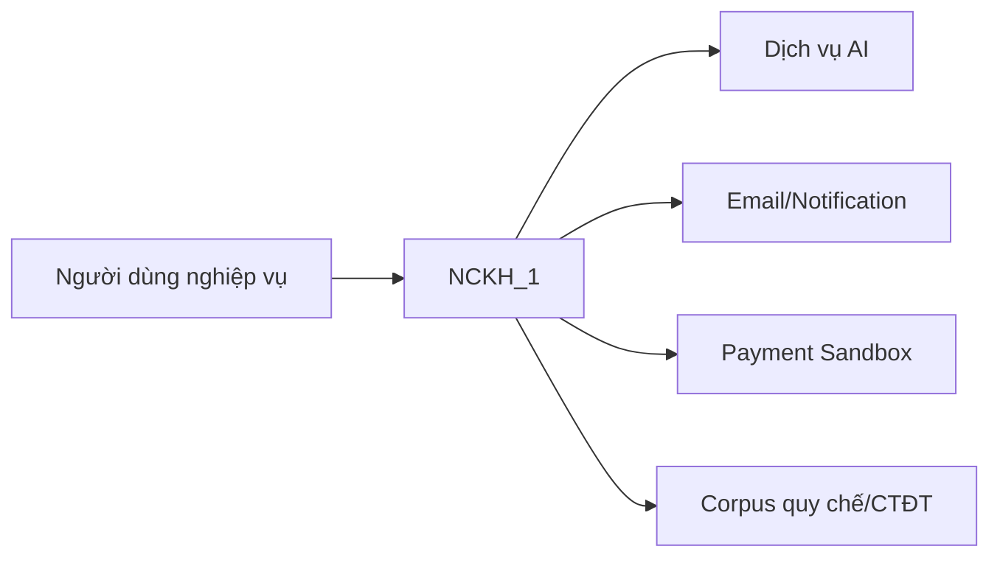
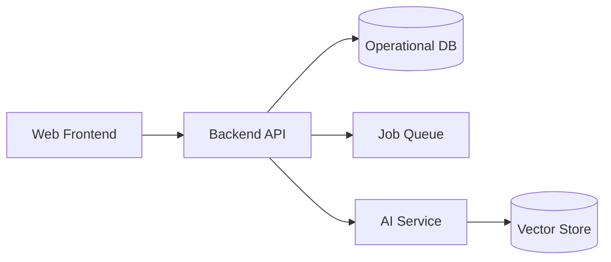

# 02 — Thiết kế Tổng thể (High-Level Design)

## 1. Thông tin tài liệu

### 1.1. Metadata

| Thuộc tính | Giá trị |
| :-- | :-- |
| Tên tài liệu | Thiết kế Tổng thể (_High-Level Design_) |
| Mã tài liệu | 02-hld |
| Dự án | Nền tảng tích hợp hỗ trợ tổ chức đào tạo (NCKH_1) |
| Phiên bản | v0.1.0 |
| Trạng thái | Draft |
| Người viết | AI Agent |
| Người duyệt | (chưa duyệt) |
| Ngày tạo | 2026-06-13 |
| Ngày cập nhật | 2026-06-13 |
| Tài liệu liên quan | [`../../CLAUDE.md`](../../CLAUDE.md), [`00-quy-chuan.md`](00-quy-chuan.md), [`01-srs.md`](01-srs.md), [`10-architecture-decision-record.md`](10-architecture-decision-record.md), [`../context/DOMAIN-MAP.md`](../context/DOMAIN-MAP.md) |

### 1.2. Lịch sử thay đổi (Changelog)

| Phiên bản | Ngày | Tác giả | Thay đổi |
| :-- | :-- | :-- | :-- |
| 0.1.0 | 2026-06-13 | AI Agent | Tạo skeleton HLD. |

---

## 2. Mục đích & phạm vi

Tài liệu này sẽ mô tả kiến trúc tổng thể của NCKH_1 ở mức C4 L1/L2, chiến lược dữ liệu, AI và bảo mật. Hiện tại chỉ là skeleton, mọi quyết định còn TBD.

## 3. Đầu vào thiết kế

- [`01-srs.md`](01-srs.md)
- [`../context/DOMAIN-MAP.md`](../context/DOMAIN-MAP.md)
- [`10-architecture-decision-record.md`](10-architecture-decision-record.md)
- [`../context/01-muc-tieu-nghien-cuu-ai.md`](../context/01-muc-tieu-nghien-cuu-ai.md)

## 4. Sơ đồ ngữ cảnh (C4 Level 1)

## 5. Sơ đồ container (C4 Level 2)

## 6. Chiến lược dữ liệu

TBD: nguồn sự thật duy nhất, dữ liệu AI/RAG, audit log, backup và dữ liệu ẩn danh.

## 7. Chiến lược AI

TBD: RAG, prompt template, verifier, fallback, human approval, logging token/cost.

## 8. Chiến lược bảo mật

TBD: RBAC/ABAC, default deny, mã hoá, session, audit log, quyền SysAdmin.

## 9. Quyết định kiến trúc lớn

| ADR | Quyết định | Trạng thái |
| :-- | :-- | :-- |
| ADR-001 | Cặp LLM provider | Proposed |
| ADR-002 | Tách glossary & traceability | Accepted |
| ADR-003 | TBD | TBD |

## 10. Mapping FR/NFR ↔ container

| FR/NFR | Container | Ghi chú |
| :-- | :-- | :-- |
| TBD | TBD | Bổ sung sau khi HLD chốt. |

## 11. Open Questions

| Mã | Câu hỏi mở | Tác động |
| :-- | :-- | :-- |
| HLD-OPEN-001 | Chọn stack triển khai chính là gì? | Ảnh hưởng toàn bộ container. |
| HLD-OPEN-002 | Backend monolith hay tách AI service ngay từ MVP? | Ảnh hưởng complexity và test. |
| HLD-OPEN-003 | Vector store/corpus versioning làm thế nào? | Ảnh hưởng AI-004 và tái lập. |

## 12. Tham chiếu

- [`01-srs.md`](01-srs.md)
- [`10-architecture-decision-record.md`](10-architecture-decision-record.md)
- [`../context/DOMAIN-MAP.md`](../context/DOMAIN-MAP.md)
- [`00-quy-chuan.md`](00-quy-chuan.md)