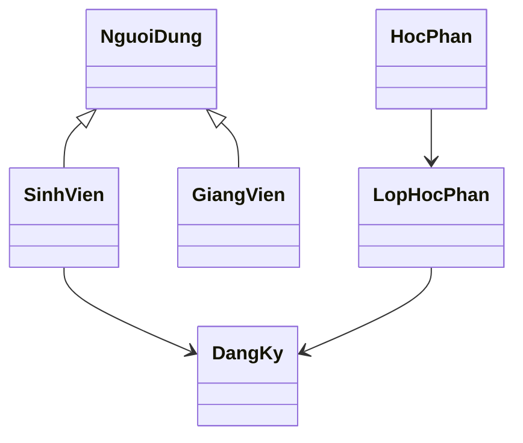

# 03 — Thiết kế Chi tiết (Low-Level Design)

## 1. Thông tin tài liệu

### 1.1. Metadata

| Thuộc tính | Giá trị |
| :-- | :-- |
| Tên tài liệu | Thiết kế Chi tiết (_Low-Level Design_) |
| Mã tài liệu | 03-lld |
| Dự án | Nền tảng tích hợp hỗ trợ tổ chức đào tạo (NCKH_1) |
| Phiên bản | v0.1.0 |
| Trạng thái | Draft |
| Người viết | AI Agent |
| Người duyệt | (chưa duyệt) |
| Ngày tạo | 2026-06-13 |
| Ngày cập nhật | 2026-06-13 |
| Tài liệu liên quan | [`../../CLAUDE.md`](../../CLAUDE.md), [`00-quy-chuan.md`](00-quy-chuan.md), [`01-srs.md`](01-srs.md), [`02-hld.md`](02-hld.md) |

### 1.2. Lịch sử thay đổi (Changelog)

| Phiên bản | Ngày | Tác giả | Thay đổi |
| :-- | :-- | :-- | :-- |
| 0.1.0 | 2026-06-13 | AI Agent | Tạo skeleton LLD. |

---

## 2. Mục đích & phạm vi

Tài liệu này sẽ chi tiết hoá HLD thành component, domain model, sequence diagram và state machine. Hiện chỉ là khung.

## 3. Đầu vào chi tiết

- [`02-hld.md`](02-hld.md)
- [`01-srs.md`](01-srs.md)
- [`../context/DOMAIN-MAP.md`](../context/DOMAIN-MAP.md)

## 4. Component diagram

TBD: component cho backend API, AI service, frontend và job worker.

## 5. Domain model

## 6. Sequence diagram

| Luồng | UC | Trạng thái |
| :-- | :-- | :-- |
| Đăng ký học phần | UC-006 | TBD |
| Sinh TKB AI | UC-002 | TBD |
| Ước tính học phí | UC-007 | TBD |
| Hỏi đáp học vụ | UC-015 | TBD |

## 7. State machine

| Thực thể | Nguồn | Trạng thái |
| :-- | :-- | :-- |
| Kế hoạch học tập | [`01-srs.md §17.1`](01-srs.md#171-kế-hoạch-học-tập) | TBD |
| Học kỳ | [`01-srs.md §17.2`](01-srs.md#172-học-kỳ) | TBD |
| Lớp học phần | [`01-srs.md §17.3`](01-srs.md#173-lớp-học-phần) | TBD |
| Hoá đơn sandbox | [`01-srs.md §17.6`](01-srs.md#176-hoá-đơn-học-phí-sandbox) | TBD |

## 8. Mapping component ↔ FR

| Component | FR | Ghi chú |
| :-- | :-- | :-- |
| TBD | TBD | Bổ sung sau khi chốt component. |

## 9. Open Questions

| Mã | Câu hỏi mở | Tác động |
| :-- | :-- | :-- |
| LLD-OPEN-001 | Boundary giữa module nghiệp vụ và AI nằm ở đâu? | Ảnh hưởng test và logging. |
| LLD-OPEN-002 | Domain model theo entity thuần hay pattern khác? | Ảnh hưởng code và DB. |

## 10. Tham chiếu

- [`01-srs.md`](01-srs.md)
- [`02-hld.md`](02-hld.md)
- [`../context/DOMAIN-MAP.md`](../context/DOMAIN-MAP.md)
- [`00-quy-chuan.md`](00-quy-chuan.md)