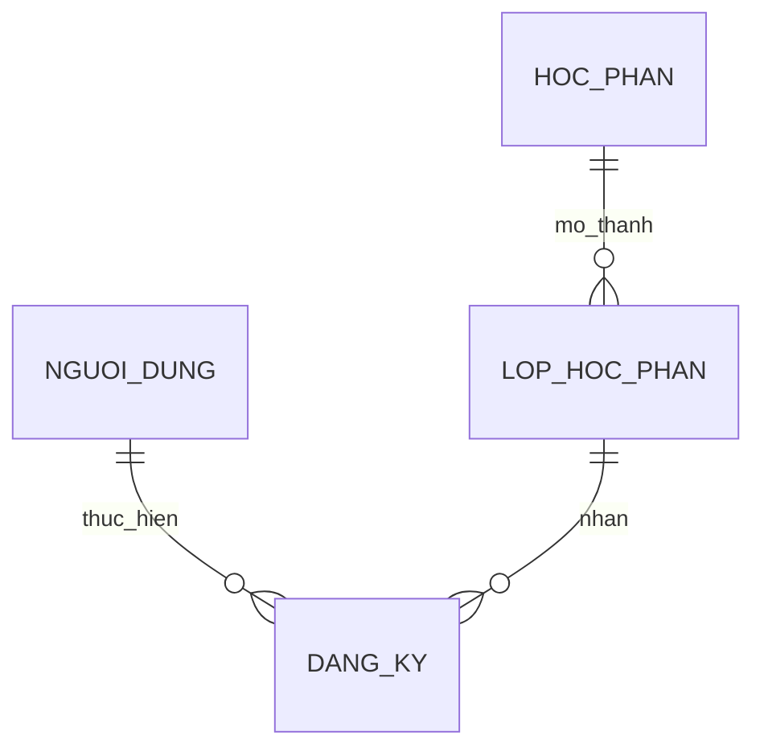

# 04 — Thiết kế Cơ sở dữ liệu (Database Design)

## 1. Thông tin tài liệu

### 1.1. Metadata

| Thuộc tính | Giá trị |
| :-- | :-- |
| Tên tài liệu | Thiết kế Cơ sở dữ liệu (_Database Design_) |
| Mã tài liệu | 04-database-design |
| Dự án | Nền tảng tích hợp hỗ trợ tổ chức đào tạo (NCKH_1) |
| Phiên bản | v0.1.0 |
| Trạng thái | Draft |
| Người viết | AI Agent |
| Người duyệt | (chưa duyệt) |
| Ngày tạo | 2026-06-13 |
| Ngày cập nhật | 2026-06-13 |
| Tài liệu liên quan | [`../../CLAUDE.md`](../../CLAUDE.md), [`00-quy-chuan.md`](00-quy-chuan.md), [`01-srs.md`](01-srs.md), [`03-lld.md`](03-lld.md) |

### 1.2. Lịch sử thay đổi (Changelog)

| Phiên bản | Ngày | Tác giả | Thay đổi |
| :-- | :-- | :-- | :-- |
| 0.1.0 | 2026-06-13 | AI Agent | Tạo skeleton Database Design. |

---

## 2. Mục đích & phạm vi

Tài liệu này sẽ mô tả ER diagram, bảng, cột, index, migration, seed và dữ liệu nhạy cảm.

## 3. Nguyên tắc dữ liệu

- Nguồn sự thật duy nhất cho dữ liệu học vụ.
- Không lưu tài chính thật.
- Khảo sát giảng dạy phải ẩn danh.
- PII phải được bảo vệ rõ ràng.

## 4. ER Diagram

## 5. Bảng & thuộc tính

| Bảng | Mục đích | Thuộc tính chính | Trạng thái |
| :-- | :-- | :-- | :-- |
| TBD | TBD | TBD | TBD |

## 6. Khoá & ràng buộc

TBD: unique, FK, check, nullability, default, cascade.

## 7. Chỉ mục

TBD: index theo truy vấn đăng ký, lịch thi, GPA, dashboard và AI lookup.

## 8. Migration & seed

TBD: quy trình migration, rollback, seed danh mục và dữ liệu giả lập.

## 9. Dữ liệu nhạy cảm

| Loại dữ liệu | Ví dụ | Biện pháp |
| :-- | :-- | :-- |
| PII | Họ tên, email, MSSV | TBD |
| Điểm | GPA, điểm thành phần | TBD |
| Khảo sát | Nhận xét tự do | Ẩn danh |

## 10. Mapping bảng ↔ FR/UC

| Bảng | FR/UC | Ghi chú |
| :-- | :-- | :-- |
| TBD | TBD | Bổ sung sau khi chốt schema. |

## 11. Open Questions

| Mã | Câu hỏi mở | Tác động |
| :-- | :-- | :-- |
| DB-OPEN-001 | Chọn CSDL quan hệ nào cho MVP? | Ảnh hưởng schema và vận hành. |
| DB-OPEN-002 | Ẩn danh khảo sát theo token hay aggregate-only? | Ảnh hưởng BR-004. |

## 12. Tham chiếu

- [`01-srs.md`](01-srs.md)
- [`03-lld.md`](03-lld.md)
- [`07-security-permission-design.md`](07-security-permission-design.md)
- [`00-quy-chuan.md`](00-quy-chuan.md)