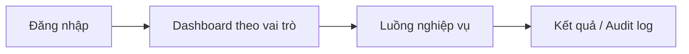

# 06 — Đặc tả Luồng UI/UX (UI/UX Flow Specification)

## 1. Thông tin tài liệu

### 1.1. Metadata

| Thuộc tính | Giá trị |
| :-- | :-- |
| Tên tài liệu | Đặc tả Luồng UI/UX (_UI/UX Flow Specification_) |
| Mã tài liệu | 06-ui-ux-flow-specification |
| Dự án | Nền tảng tích hợp hỗ trợ tổ chức đào tạo (NCKH_1) |
| Phiên bản | v0.1.0 |
| Trạng thái | Draft |
| Người viết | AI Agent |
| Người duyệt | (chưa duyệt) |
| Ngày tạo | 2026-06-13 |
| Ngày cập nhật | 2026-06-13 |
| Tài liệu liên quan | [`../../CLAUDE.md`](../../CLAUDE.md), [`00-quy-chuan.md`](00-quy-chuan.md), [`01-srs.md`](01-srs.md), [`05-api-specification.md`](05-api-specification.md) |

### 1.2. Lịch sử thay đổi (Changelog)

| Phiên bản | Ngày | Tác giả | Thay đổi |
| :-- | :-- | :-- | :-- |
| 0.1.0 | 2026-06-13 | AI Agent | Tạo skeleton UI/UX Flow Specification. |

---

## 2. Mục đích & phạm vi

Tài liệu này sẽ mô tả bản đồ màn hình, user flow, wireframe, trạng thái UI và accessibility cho 6 nhóm nghiệp vụ + SysAdmin.

## 3. Nguyên tắc UX

- Ưu tiên thao tác nghiệp vụ rõ ràng, có phản hồi trạng thái.
- Lãnh đạo chỉ có luồng đọc/xuất báo cáo.
- AI output cần trạng thái chờ duyệt khi gửi ra ngoài.
- Hỏi đáp học vụ phải hiển thị trích dẫn nguồn.

## 4. Bản đồ màn hình

| Vai trò | Màn hình chính | UC liên quan |
| :-- | :-- | :-- |
| Sinh viên | Kế hoạch, đăng ký, học phí, bảng điểm, khảo sát, hỏi đáp | UC-001, UC-006, UC-015 |
| Phòng Đào tạo | Lớp học phần, học phí, cảnh báo, báo cáo | UC-004, UC-008 |
| Khoa / Bộ môn | CTĐT, học phần, phân công, đánh giá | UC-017, UC-014 |
| SysAdmin | Tài khoản, vai trò, audit log | UC-018 |

## 5. User flow

## 6. Wireframe / low-fi mockup

TBD: mô tả dạng cây hoặc liên kết Figma/ảnh trong `doc/SDLC/assets/`.

## 7. Trạng thái UI

| Trạng thái | Quy ước cần mô tả | Ví dụ |
| :-- | :-- | :-- |
| Empty | TBD | Không có kế hoạch chờ duyệt. |
| Loading | TBD | Đang sinh TKB AI. |
| Error | TBD | Trùng lịch / thiếu tiên quyết. |
| Success | TBD | Đăng ký thành công. |

## 8. Accessibility

TBD: WCAG 2.1 AA cho luồng chính, keyboard navigation, focus state, contrast, thông báo lỗi form.

## 9. Mapping UI ↔ UC/FR

| UI ID | Màn hình/flow | UC/FR | Trạng thái |
| :-- | :-- | :-- | :-- |
| UI-001 | TBD | TBD | TBD |

## 10. Open Questions

| Mã | Câu hỏi mở | Tác động |
| :-- | :-- | :-- |
| UI-OPEN-001 | Có cần mobile-first cho sinh viên không? | Ảnh hưởng layout và test UI. |
| UI-OPEN-002 | Dùng design system nào? | Ảnh hưởng tính nhất quán. |

## 11. Tham chiếu

- [`01-srs.md`](01-srs.md)
- [`05-api-specification.md`](05-api-specification.md)
- [`07-security-permission-design.md`](07-security-permission-design.md)
- WCAG 2.1 AA