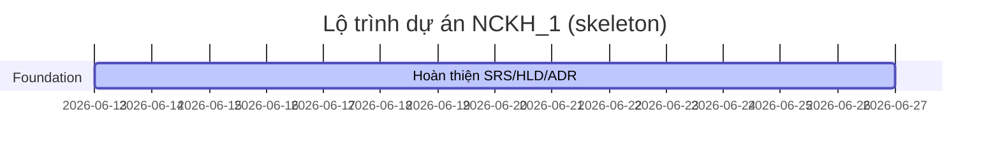

# 11 — Phân rã Công việc Dự án (Project Task Breakdown)

## 1. Thông tin tài liệu

### 1.1. Metadata

| Thuộc tính | Giá trị |
| :-- | :-- |
| Tên tài liệu | Phân rã Công việc Dự án (_Project Task Breakdown_) |
| Mã tài liệu | 11-project-task-breakdown |
| Dự án | Nền tảng tích hợp hỗ trợ tổ chức đào tạo (NCKH_1) |
| Phiên bản | v0.1.0 |
| Trạng thái | Draft |
| Người viết | AI Agent |
| Người duyệt | (chưa duyệt) |
| Ngày tạo | 2026-06-13 |
| Ngày cập nhật | 2026-06-13 |
| Tài liệu liên quan | [`../../CLAUDE.md`](../../CLAUDE.md), [`00-quy-chuan.md`](00-quy-chuan.md), [`02-hld.md`](02-hld.md), [`08-test-plan-acceptance-criteria.md`](08-test-plan-acceptance-criteria.md), [`../context/PROJECT-STATE.md`](../context/PROJECT-STATE.md) |

### 1.2. Lịch sử thay đổi (Changelog)

| Phiên bản | Ngày | Tác giả | Thay đổi |
| :-- | :-- | :-- | :-- |
| 0.1.0 | 2026-06-13 | AI Agent | Tạo skeleton Project Task Breakdown. |

---

## 2. Mục đích & phạm vi

Tài liệu này sẽ phân rã công việc thành epic, story và task. Hiện tại chỉ là khung để gắn WBS sau khi HLD và test plan ổn định.

## 3. Nguyên tắc lập kế hoạch

- Task phải ánh xạ được tới FR/UC hoặc tài liệu SDLC.
- Không tạo task code trước khi HLD/LLD đủ rõ.
- Ước lượng dùng story point hoặc giờ làm việc.
- Task AI phải kèm metric hoặc bộ đánh giá liên quan.

## 4. WBS tổng quan

| Epic | Mô tả | Phụ thuộc | Trạng thái |
| :-- | :-- | :-- | :-- |
| EPIC-001 | Foundation | 00, 01, context | TBD |
| EPIC-002 | Kiến trúc & thiết kế | 02, 03 | TBD |
| EPIC-003 | Học vụ cốt lõi | 01, 03, 04, 05, 06 | TBD |
| EPIC-004 | AI & nghiên cứu VACS | context AI, 08 | TBD |
| EPIC-005 | Kiểm thử, bảo mật, vận hành | 07, 08, 09 | TBD |

## 5. Task breakdown

| Task ID | Story/Epic | Mô tả | Ước lượng | Phụ thuộc | Tiêu chí hoàn thành |
| :-- | :-- | :-- | :-- | :-- | :-- |
| TASK-001 | EPIC-001 | TBD | TBD | TBD | TBD |

## 6. Milestone & phụ thuộc

TBD: bổ sung lịch thật sau khi thống nhất deadline và nguồn lực.

## 7. Ước lượng & phân công

| Hạng mục | Quy ước | Trạng thái |
| :-- | :-- | :-- |
| Đơn vị ước lượng | Story point hoặc giờ | TBD |
| Vai trò phụ trách | Owner/Reviewer | TBD |
| Buffer | TBD | TBD |

## 8. Traceability task ↔ FR/UC

| Task ID | FR/UC/AI | Tài liệu liên quan | Ghi chú |
| :-- | :-- | :-- | :-- |
| TBD | TBD | TBD | TBD |

## 9. Rủi ro & Open Questions

| Mã | Nội dung | Tác động |
| :-- | :-- | :-- |
| TASK-OPEN-001 | Deadline luận văn và nguồn lực chưa chốt. | Ảnh hưởng lịch và ước lượng. |
| TASK-OPEN-002 | Cần chốt production hay staging demo. | Ảnh hưởng scope triển khai. |

## 10. Tham chiếu

- [`02-hld.md`](02-hld.md)
- [`08-test-plan-acceptance-criteria.md`](08-test-plan-acceptance-criteria.md)
- [`../context/PROJECT-STATE.md`](../context/PROJECT-STATE.md)
- [`../context/02-ke-hoach-chuan-bi-nghien-cuu.md`](../context/02-ke-hoach-chuan-bi-nghien-cuu.md)